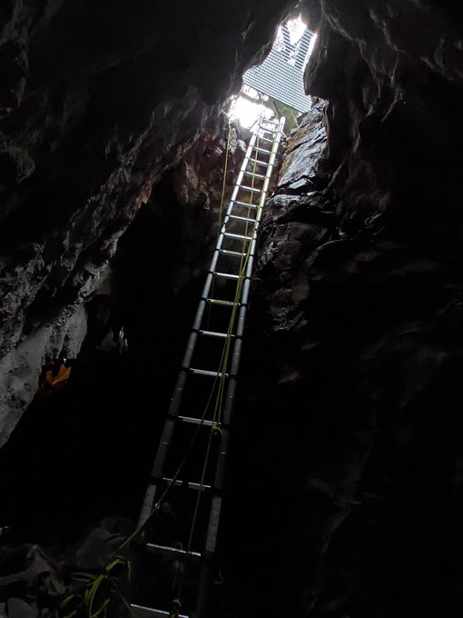
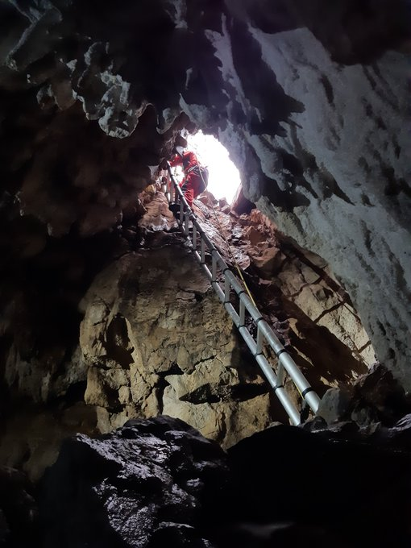
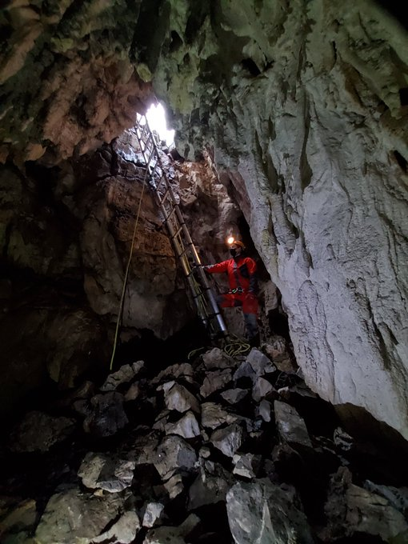
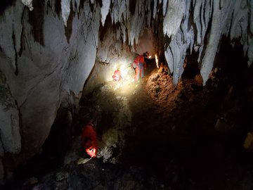
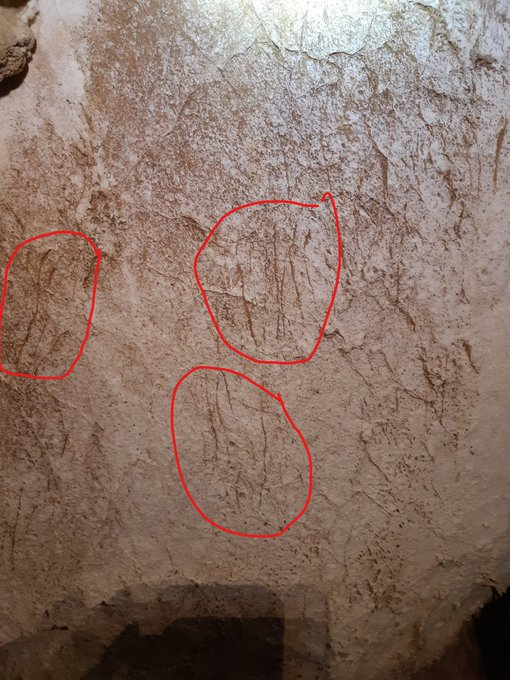
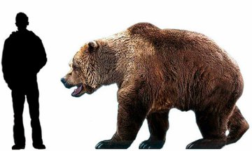
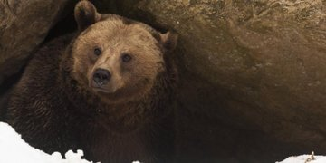
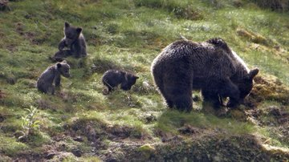

2020 urtearen amaieran, Aizarnako Atsoagureta kobazuloa miatzen hasi ziren Antxieta arkeologia taldekoak. Urte ugari eman ditu haitzuloak itxita, eta azterketa sakon bat egiten hastea erabaki zuten Antxieta taldekoek. Miaketako lehen sorpresarekin egin dute topo gaur; izan ere, hartzaren atzaparkadak aurkitu dituzte galeria nagusiaren horma batean. Antxieta taldekoen arabera, oraindik miaketa lan handia dago egiteko, eta tinko jarraituko dute lanean.

Lehen zantzuen arabera, Ursus Spelaeus leize hartzaren aztarnak izan daitezkeela uste dute arkeologoek. Hartz horiek 400 eta 600 kilo artean pisatzen zuten normalean, baina 800 kilo pisatzera ere irits zitezkeen. Batez ere belarjaleak ziren hartz horiek, eta neguan hibernazioa egiten zuten; gainera, gizakiaren aurka borroka egiten zuten kobazuloak tarteko. Duela 20.000 urte inguru desagertu zen espeziea.

