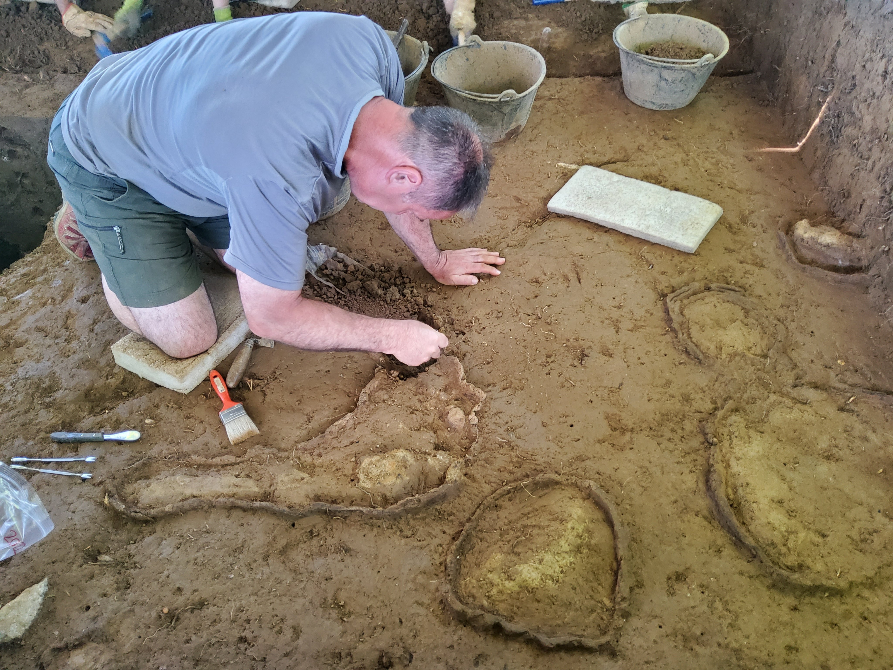
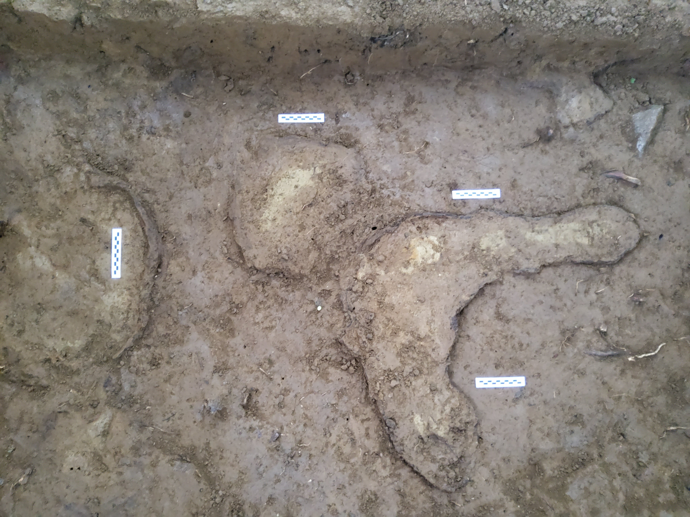
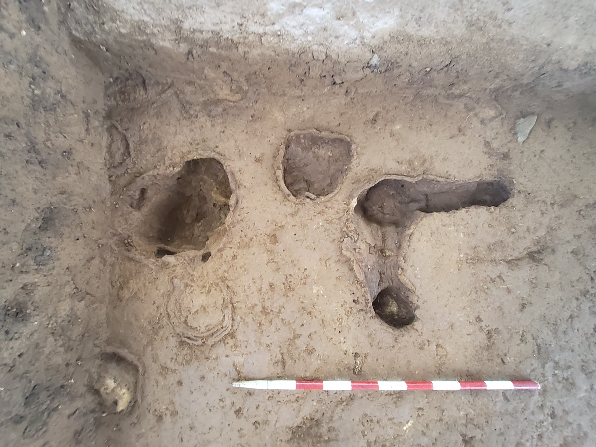
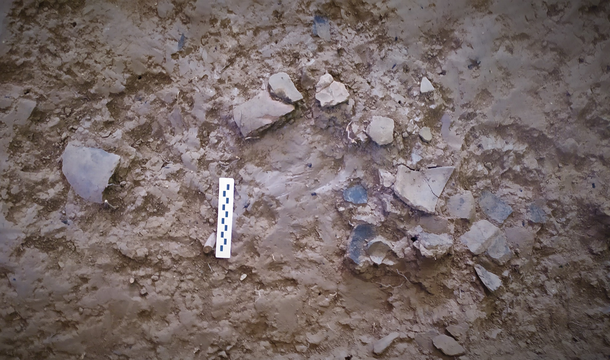
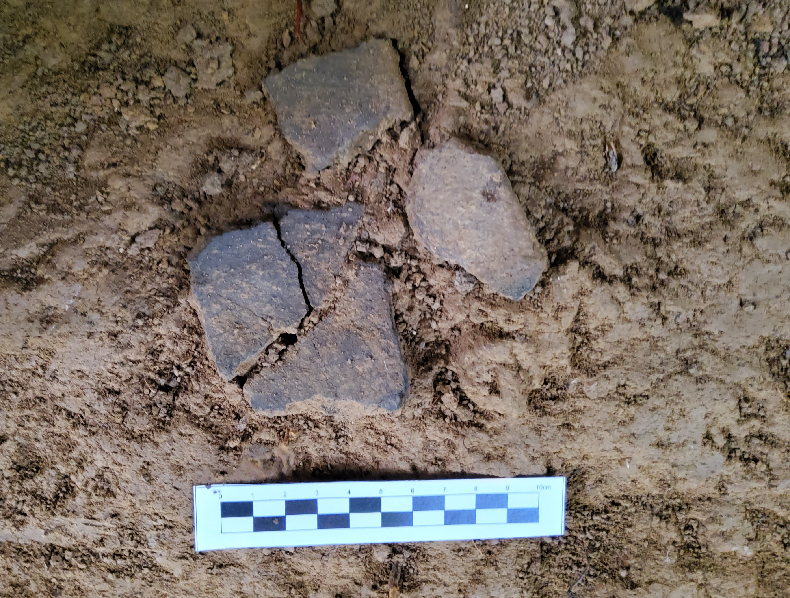
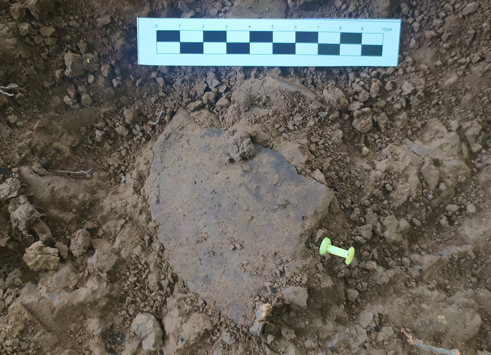
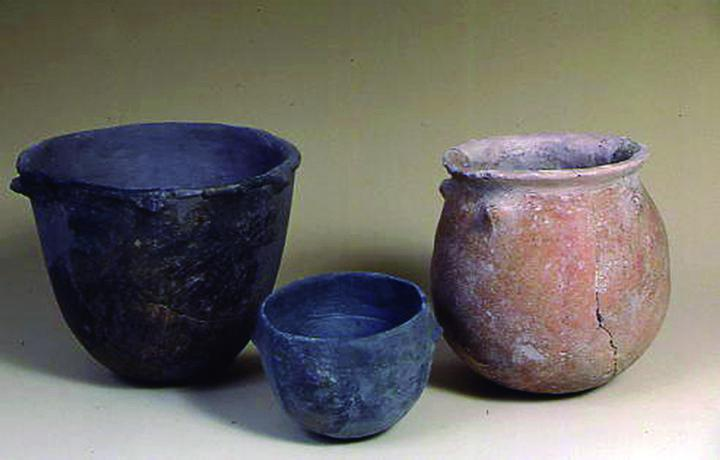
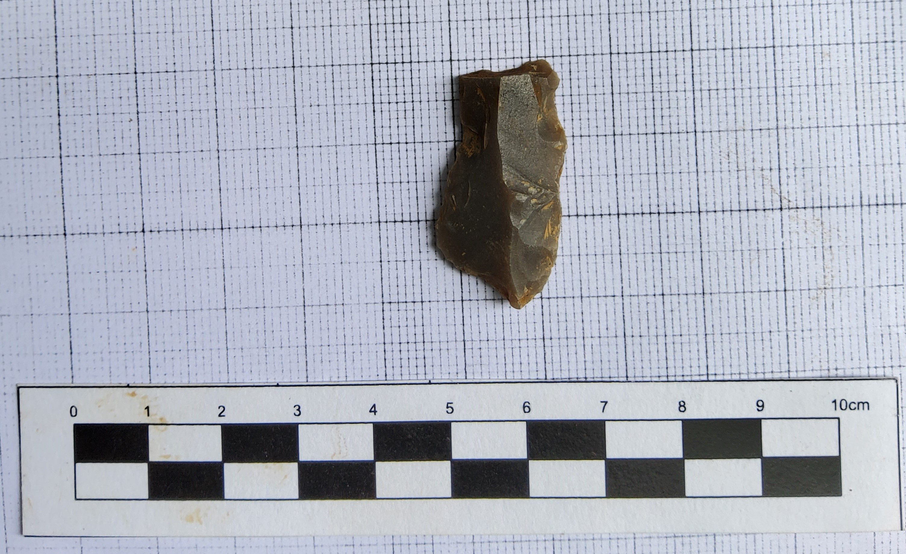
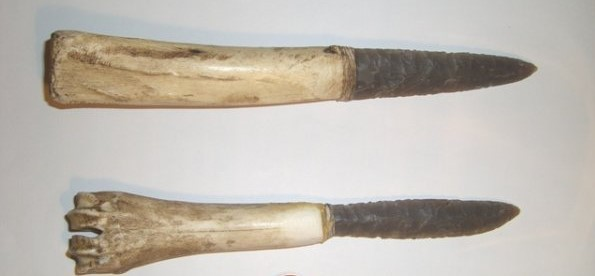
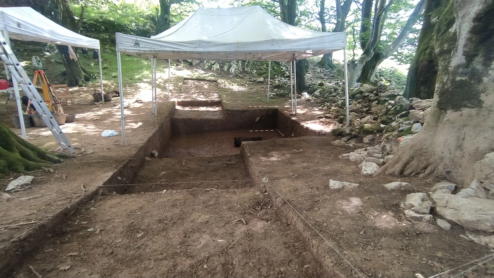

Indusketa aurrera doa eta hasi dira azaltzen lehenengo aztarnak.
Esate baterako, Izarraitzeko hondarzulo edo dolina hauetan, bertako lurra oso
mineralizatua dagoelako, Manganesoaren oxidazioaren eraginagatik sortzen diren estruktura
konplexu hauek.
Kontu handiz industu eta dokumentatu dira.

Baita ere, azaltzen dira eskuz egindako lur-ontzi multzo bikainak.
Oso apurtuak azaltzen dira baina garbitu eta gero elkartuko ditugu laborategian.
Baita, analitika berezi batzuekin, agian jakingo dugu zer jaten zuten beraietan.
Tipologiagatik Brontze arokoak izan liteke: +/- 3.500 urte, gaur egunetik.

Litika edo Harrizko tresnak ere azaltzen dira.
Gehiena erabiltzen duten harria Suharria da eta tresna hauek eduki litekeen erabilera
ezberdinak, teknologia litikoetan aditu batek, laborategian ikertuak izango dira.
Tipologiaren gatik garaia ere zehaztuko du adituak baina printzipioz Lur-ontziak bezala
Kalkolito/Brontze arokoak izan liteke: +/- 3.500 urte.

Gauza gehiago azaltzen joango dira eta datozen egunetan azalduko ditugu.

