2022 urtea fantasiaz eta mitologiaz betetako Izarraizko txoko ezezagun hauetan bukatu dugu.

Hain gertu daukagun eta hain gutxi ezagutzen dugun antzinako mendikate zahar hori.

Beti bezala, planifikazio zehatz batekin hasten gara miaketarekin, baina gero, lekuak berak erakusten digu nola eta non jarraitu.

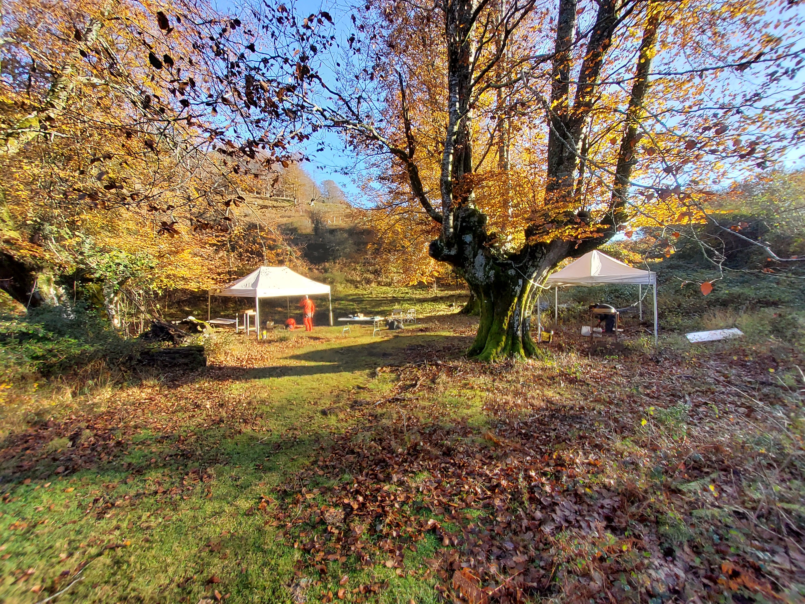
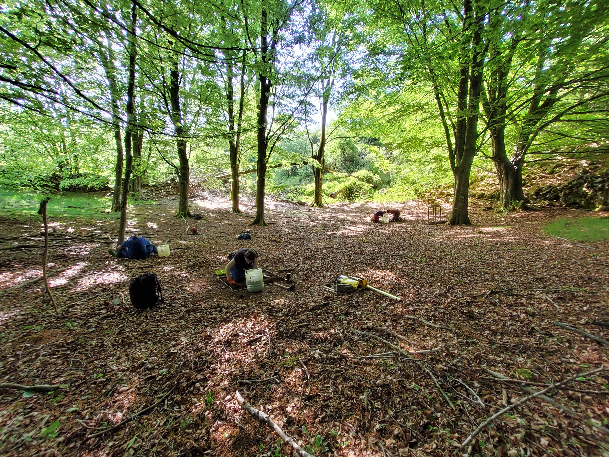
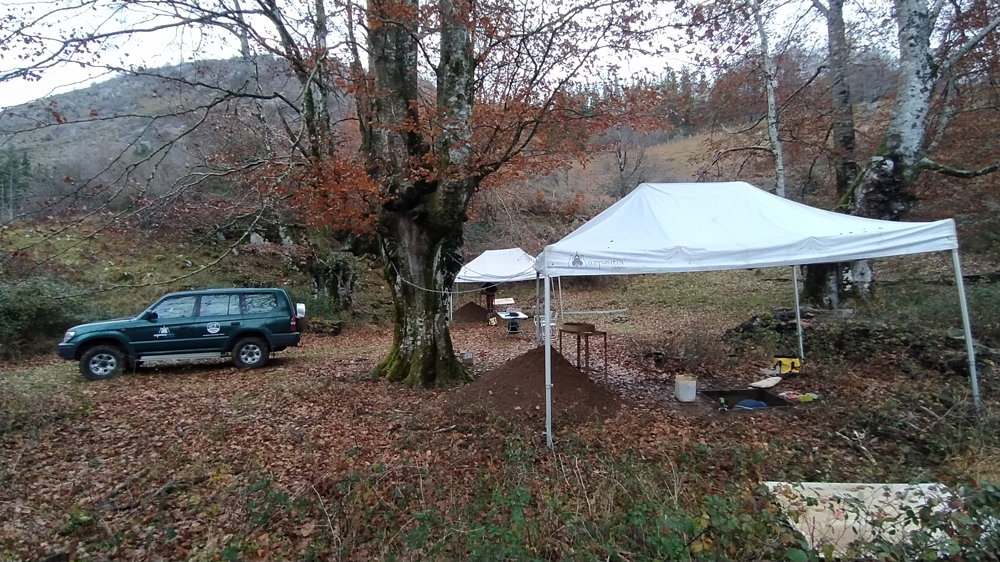
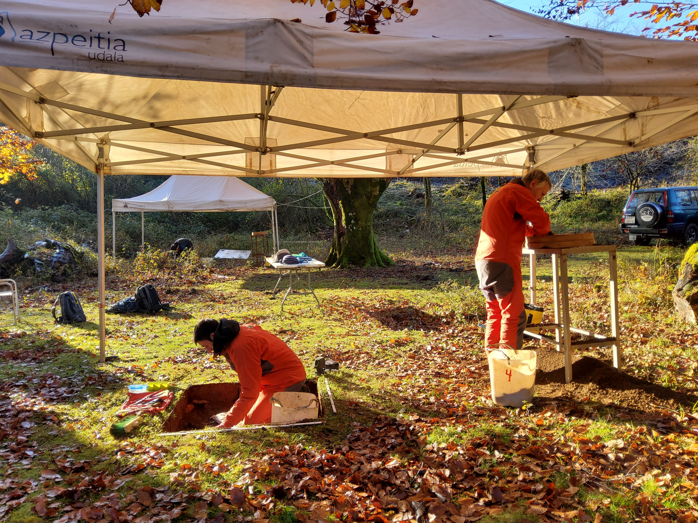

Aire zabaleko ikerketa mota honek pazientzia handia eskatzen du, eta aparteko sena behar da gure arbasoek laga zituzten pistak txikiak jarraitzeko eta azaleratzeko.

Non zulatu asmatzen ez duen taldekideari denboraldi baten ez diogu lagatzen berriro tokia aukeratzen eta zigor horrekin lortzen dugu gehienetan lekuarekin asmatzea.

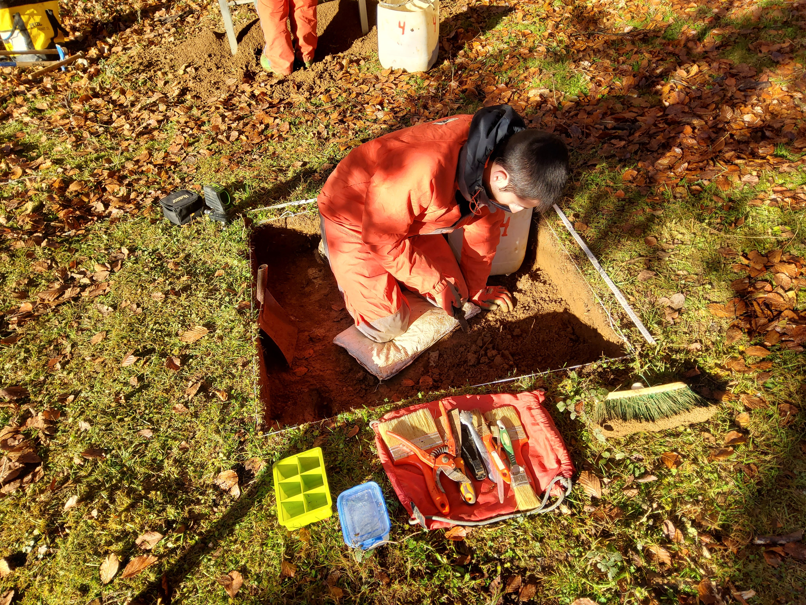
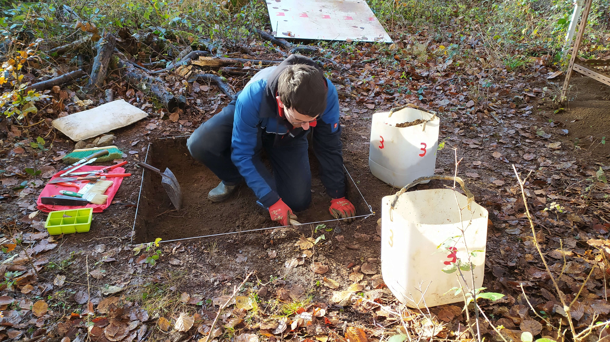
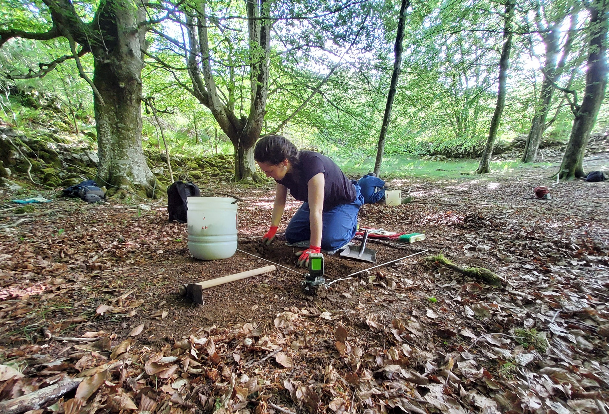
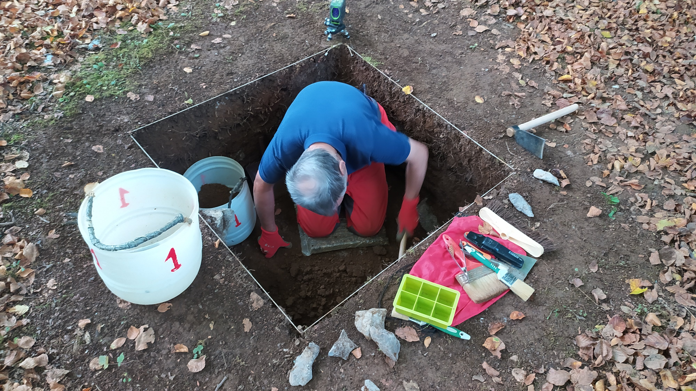

Sistema karstiko hauen sedimentazio sekuentzia nahiko berbera da.

Harritzekoa da lapiazaren tarte hauetan harririk ez egotea eta lur azal nahiko sekuentziatuak izatea.

Egin diren zundaketa denetan material arkeologikoa azaltzen da.

Mendi guztia ustiatzen zuten!

Urte berri on denoi!

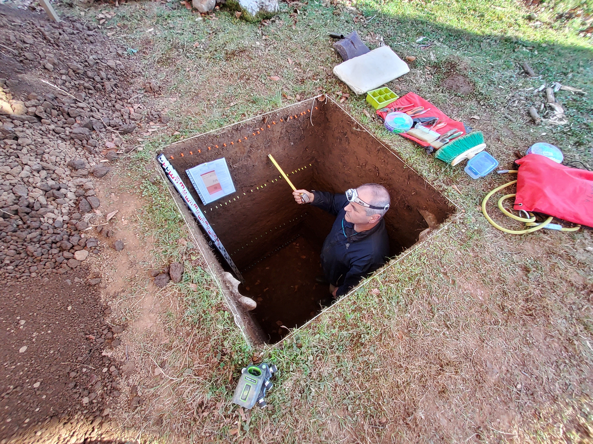
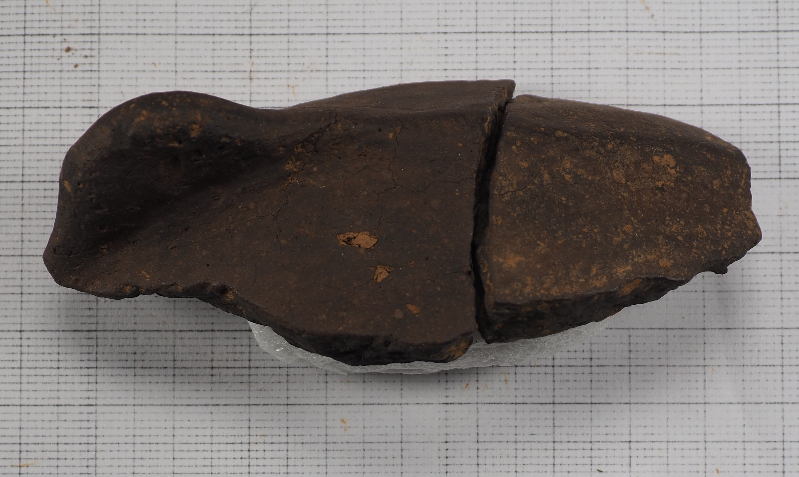
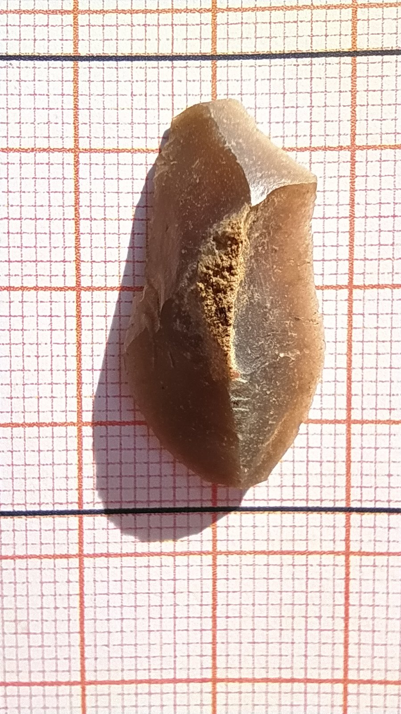
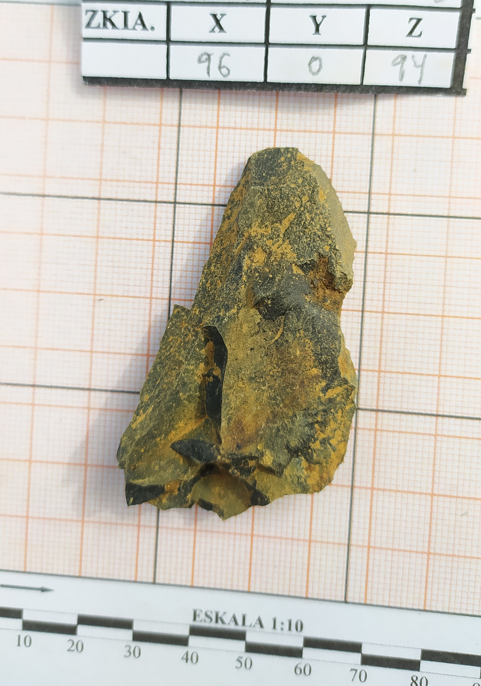
