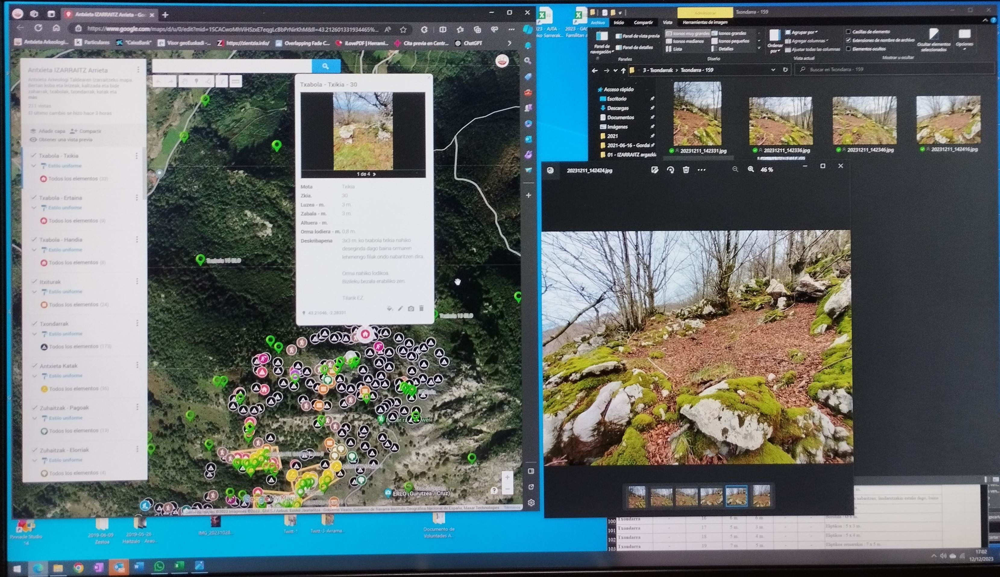
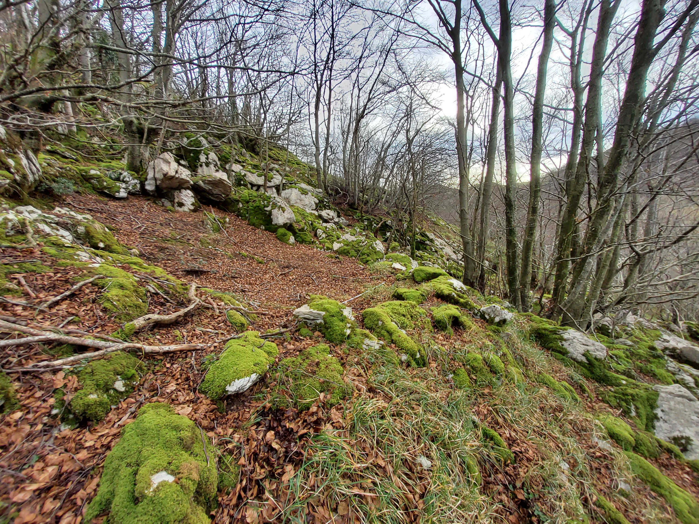
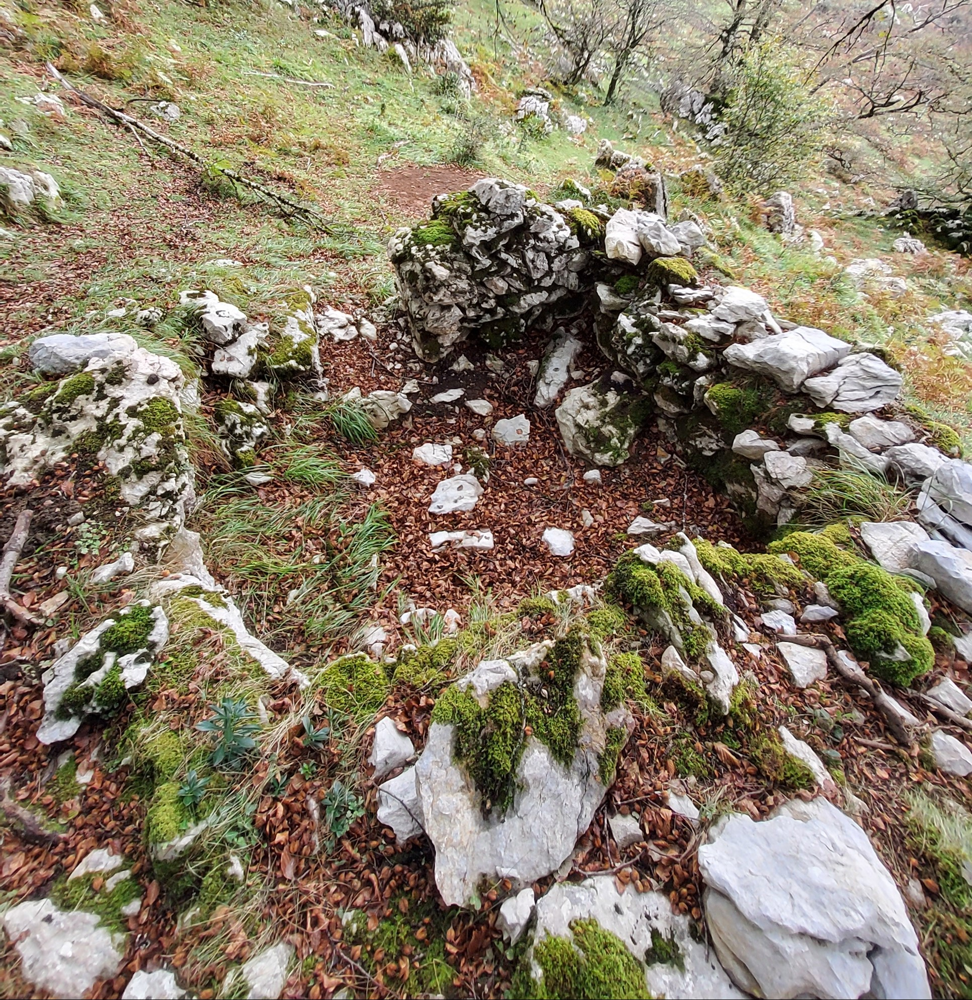
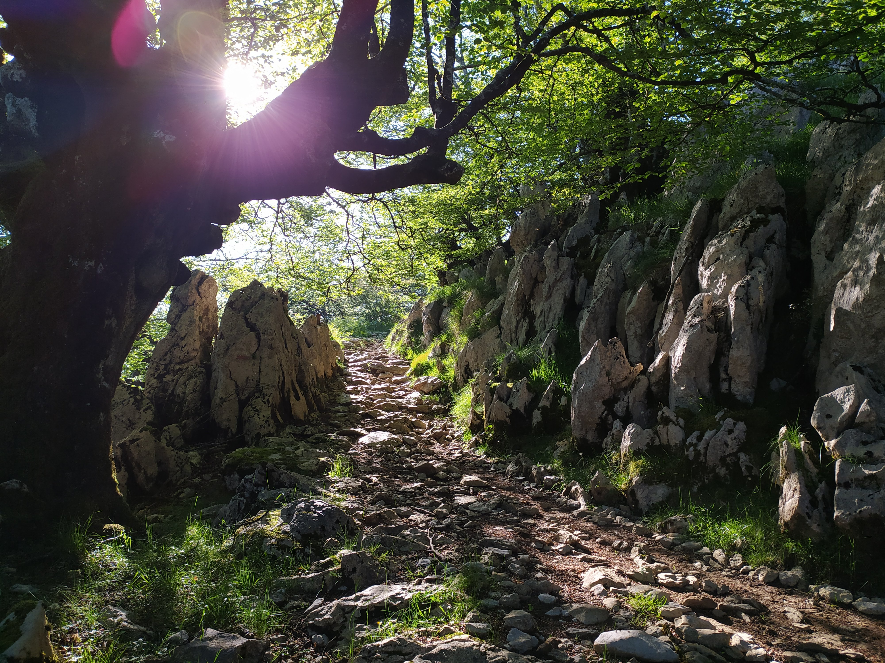
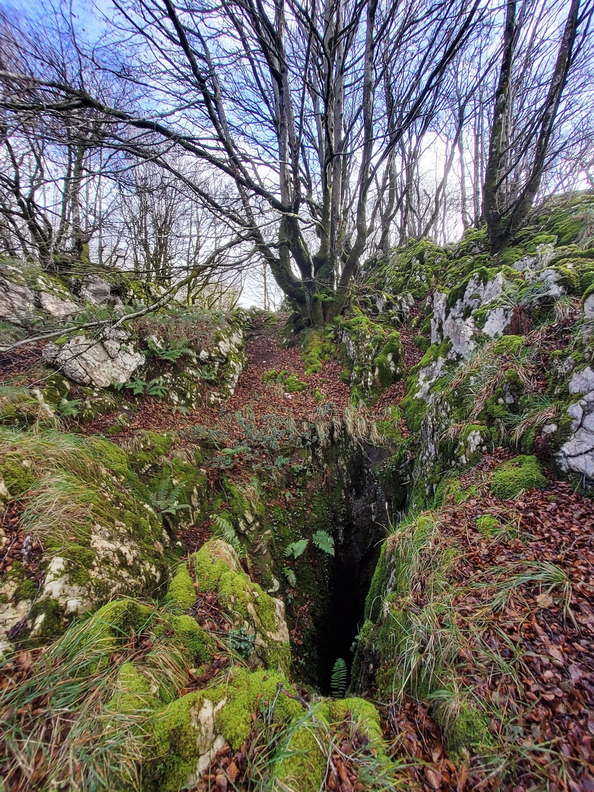
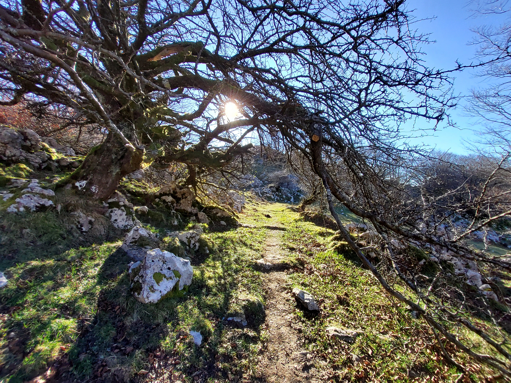
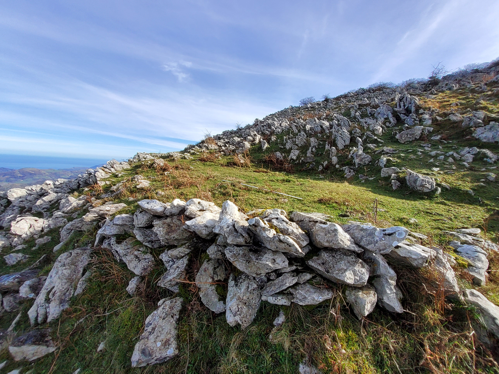
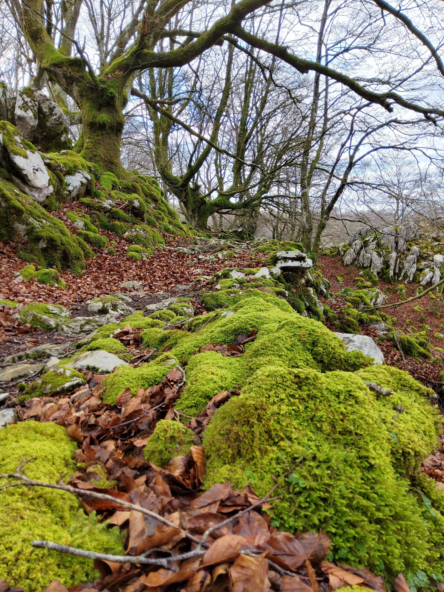
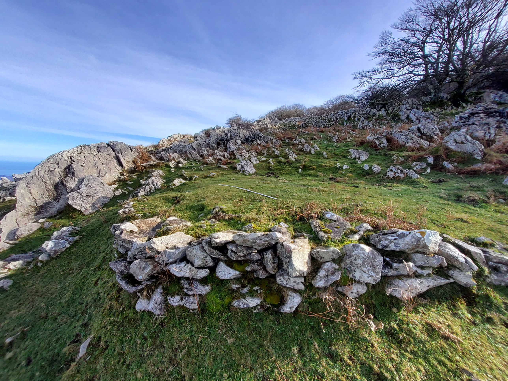
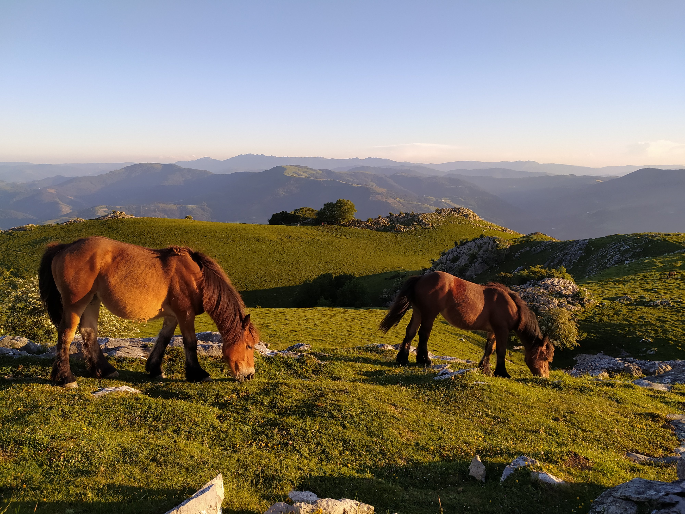

Urte honetako azken txanpara iritxi gera, IZARRAITZ-ko proiektu anitzaren barruan, etnografia atalari bultzada xumea emanaz.

Aztarna antropiko guztiak geoposizionatu eta bakoitza bere xehetasunekin katalogatzen ari gera eta sinestezina da zenbat gauza dauzkan kontatu nahian gure mendiak.

Txabolak, itxiturak, txondarrak, bideak, eta beste gauza pila.

Ikerketa hasi genuenean ezin pentsatu, hainbeste alditan pasatu geran lekuetan, milaka gauza egon litekeenik eta ohartu gabe geudenik, bertan zaudela ixil ixilik betidanik.

Egon adi lagunok, kutxa oraintxe irekitzen ari gera eta joango gera kontatzen zer azaltzen zaigun, izarretako haitz honen txokoetan.

Laster gera berriro, berriketan !!

