Urtarrilak 23, igandea. Hotza egiten du Burgos iparraldeko Merindadeetan: zero azpitik sei gradu. Eduardo Sainz-Maza adituarekin joan gara lurralde eder horretan dagoen labar arte bikaina ikustera eta ikastera. Eduardok ikerketa lan bikaina egina dauka zonalde horretan, eta miaketa lanetan laguntzeko prest agertu gara gu.

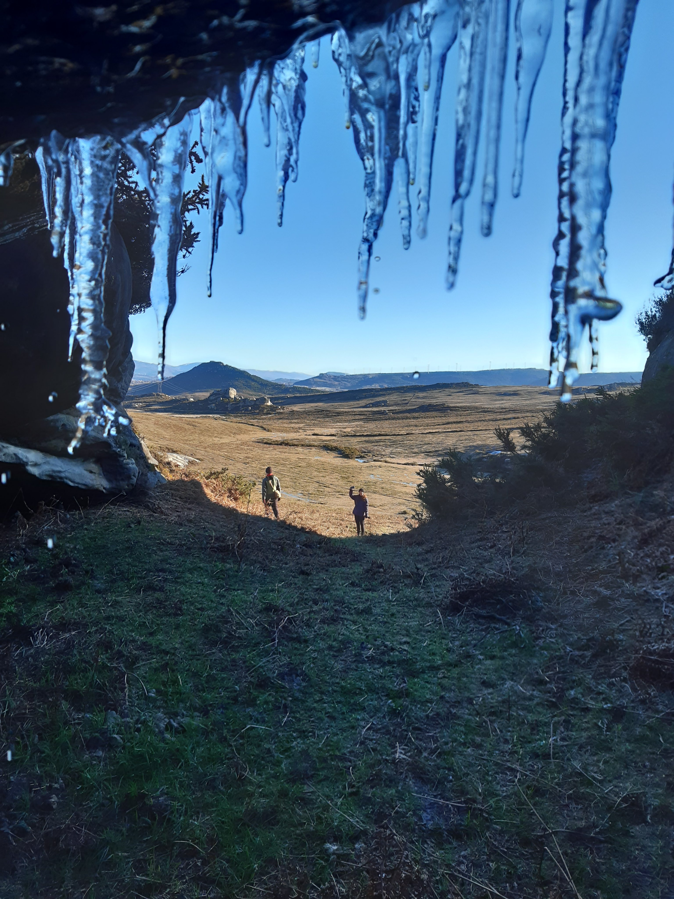
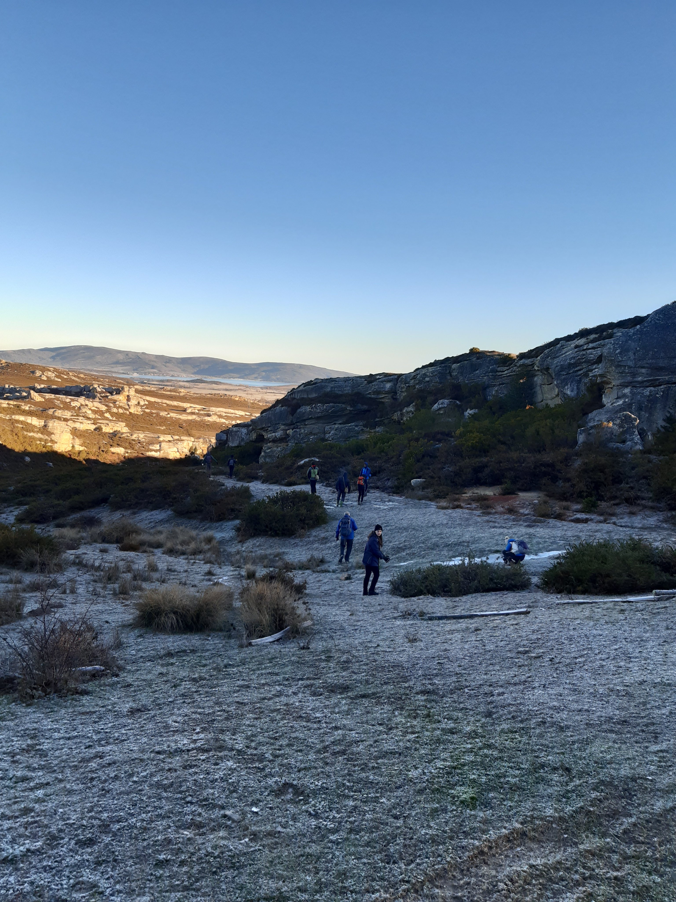
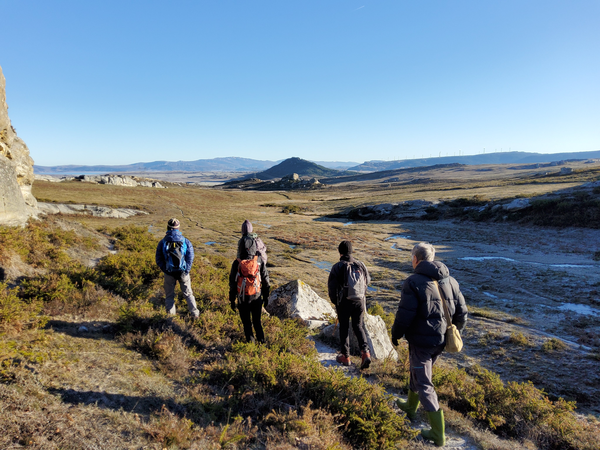

Burgos iparraldeko Merindadeetako haritz, pago edo haginez osatutako Hijedoko basoen inguruan dauden harkaitz sedimentatuek estalpe eta txoko ugari eskaintzen dituzte artista prehistorikoek beren lanak gauzatzeko. Estalpe eta harkaitz horietan gauzatu dituzte azken urteetako miaketak eta ikerketak.

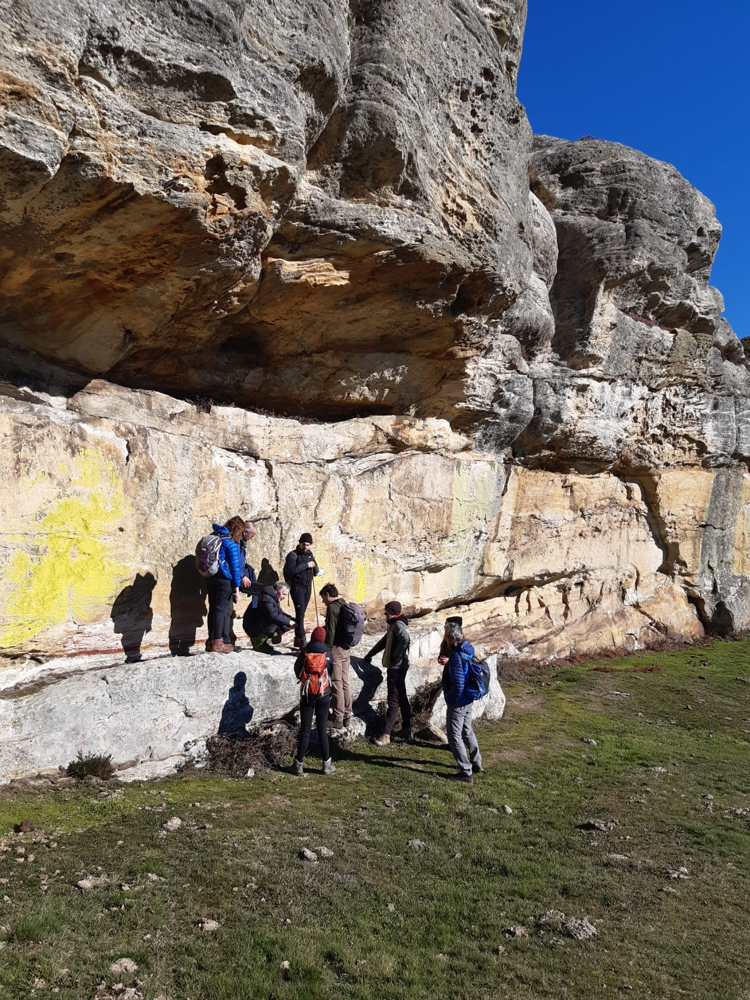
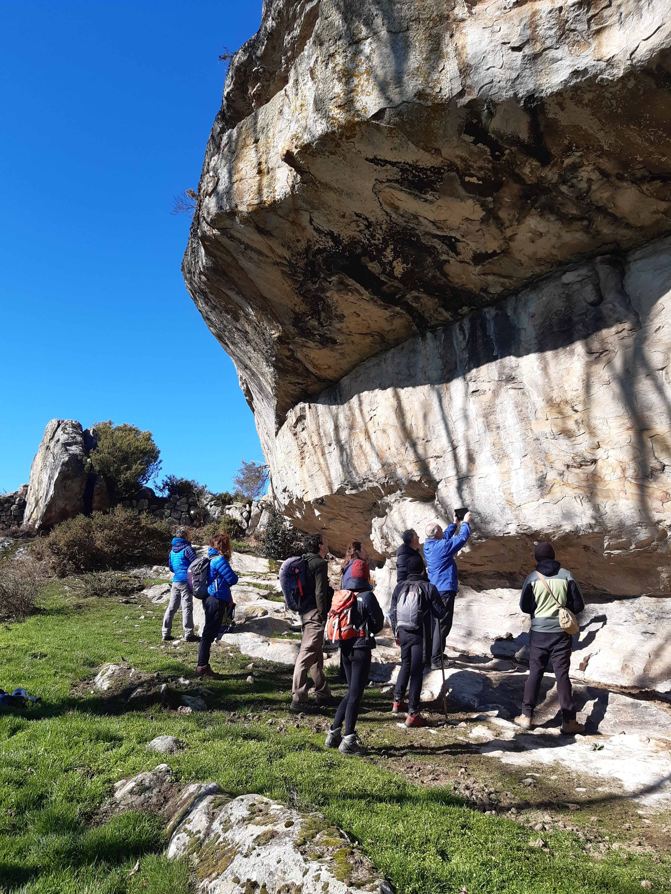
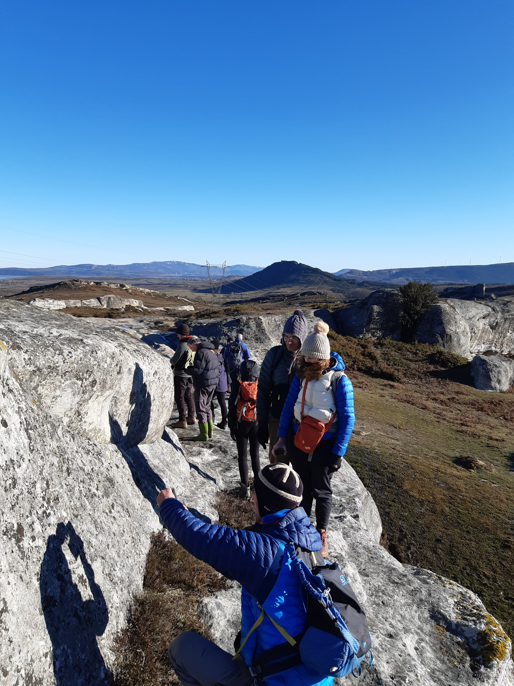
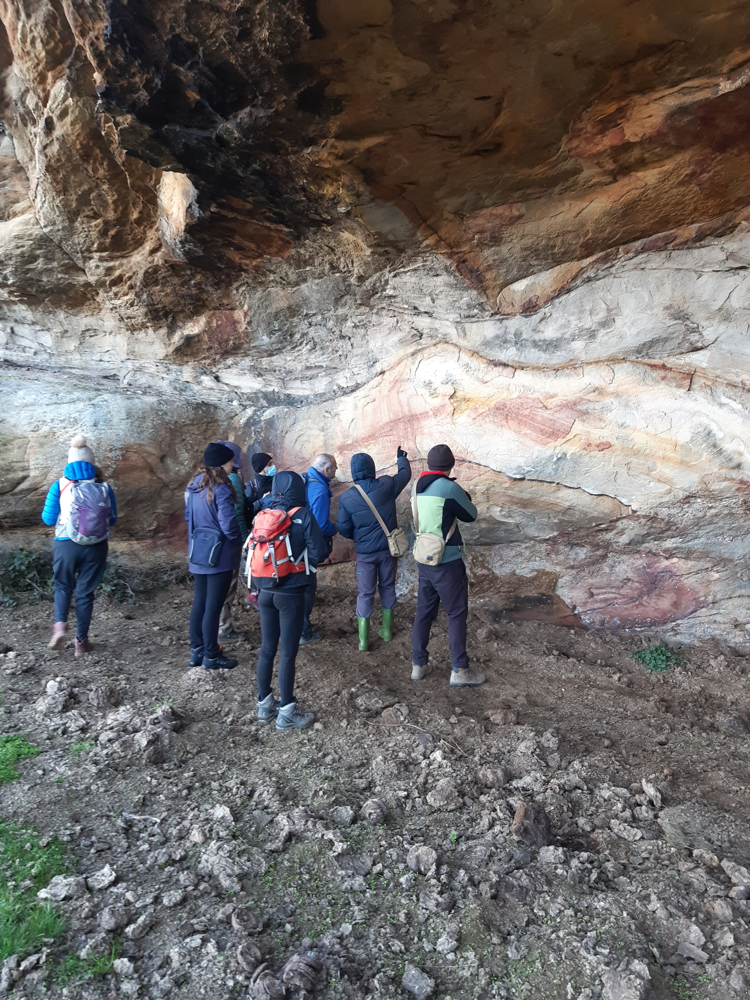

Estalpe eta harkaitz horietako miaketak eta ikerketak aurrera doazen heinean, gero eta labar arte lan ikusgarri gehiago gehiago azaltzen ari dira. Labar arte horietako gehienak paleolito ondorengo gisa katalogatzen dituzte; Neolitikotik Burdin Arora bitartean.

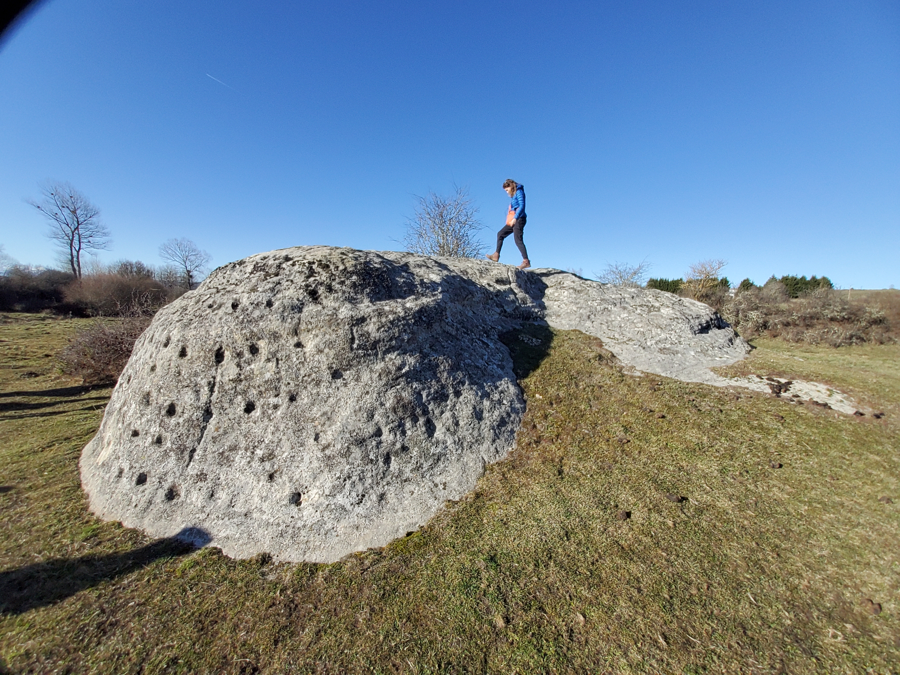
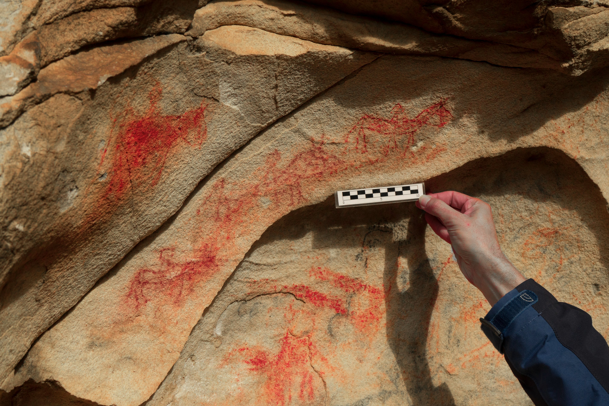
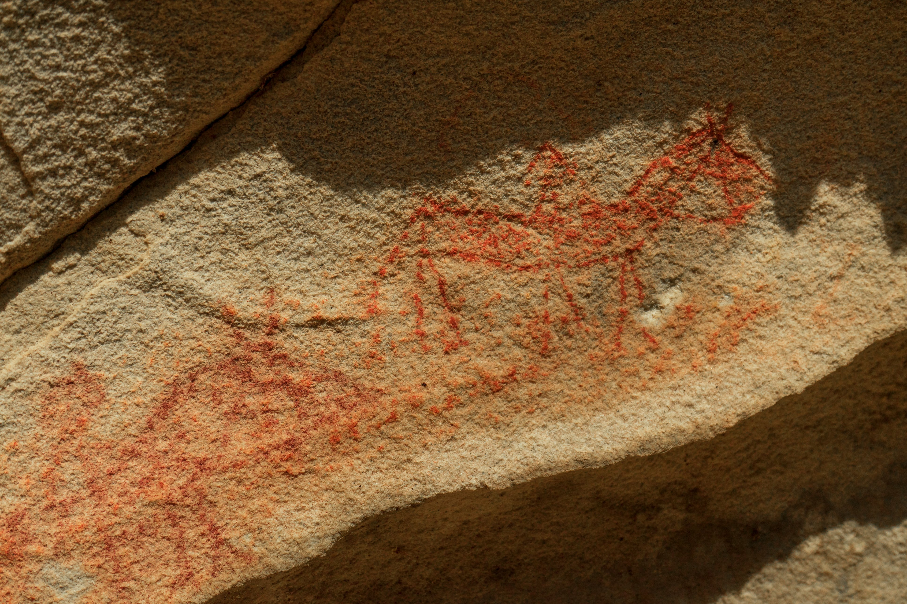
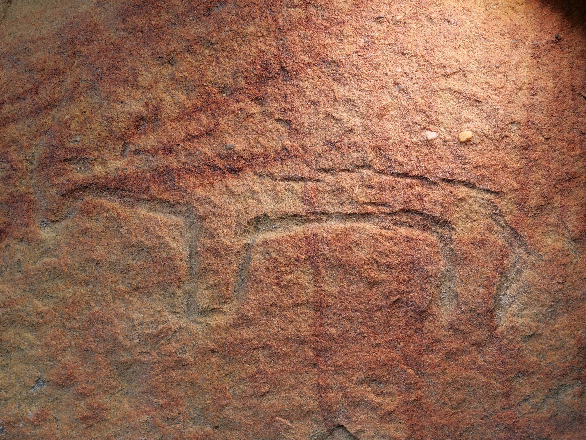
