Zestoatik pasatzerakoan ikusten genuen Behe eta Goi Paleolitoko aire zabaleko aztarnategi bikain hau zer egoera kaxkarrean aurkitzen zen, sasiek eta belar txarrek alde guztietatik janda.

Zestoako Udalean kexa aurkeztu genuen idatzi baten bidez, nahiz eta Irikaitzen ardura Foru Aldundiarena izan.  

  

  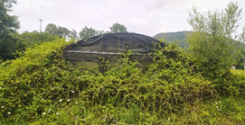
  

  

  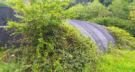
  

  

  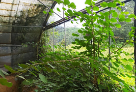
  

  

  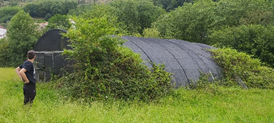
  

Erantzuna berehala jaso genuen, Mikel Arregi alkatearena: "Zergatik ez dugu garbitzen geuk auzolanean larunbat honetan? Neu desbrozadorarekin joango naiz". Zer esan behar genion...

Goiz guztia lanean eduki gintuen, kar, kar, kar!

  

  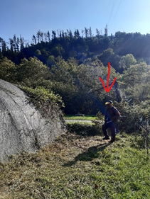
  

  

  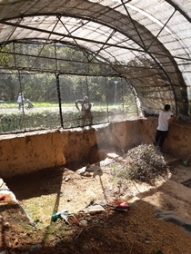
  

  

  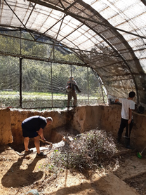
  

  

  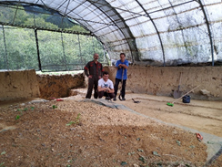
  

Auzolana bukatuta, ezin hobeto gelditu da txukunduta Irikaitzeko aztarnategia, baina hurrengorako kexatzeko estrategia hobeto pentsatu beharra daukagu. Hori da egurra eman diguna! Kanpoa eta barrua, disdirak ateratzen dituela laga behar izan dugu!

  

  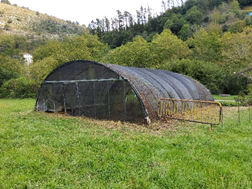
  

  

  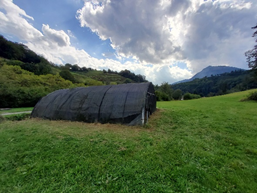
  

  

  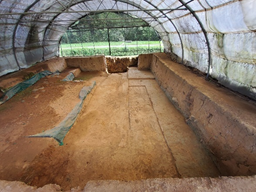
  

  

  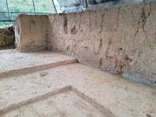
  

