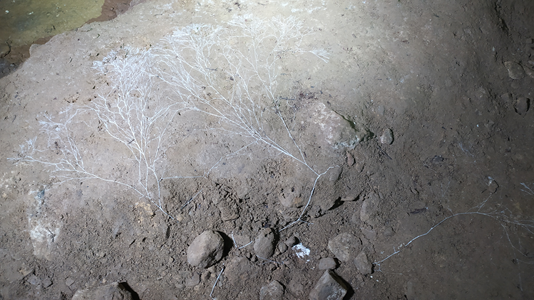
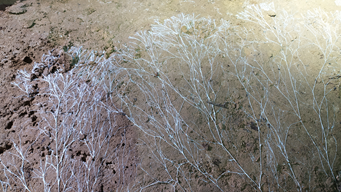
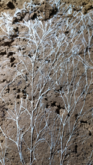

Onddo baten zuztarrak direla esango genuke. Nola bizi daiteke onddo hau, kobaren sarreratik 500 metrora, ilunpean, argirik gabe, kobazuloko bakardadean? Naturak baldintza gogorretan aurre egiteko daukan trebeziaren erakusle.

Onddoak lurretik zuzenean lortzen ditu elikagaiak, eta hifaz osatutako zuztar antzeko hau erabiltzen du. Onddoek eta likenek erabiltzen dute elikatzeko sistema hori, eta horregatik lortzen dute biek, adibidez, kobazulo barreneko baldintza konplexuetan bizitzea.

