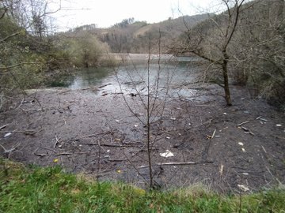
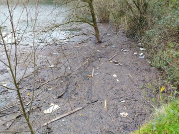
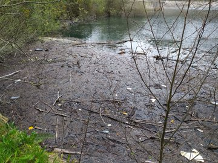
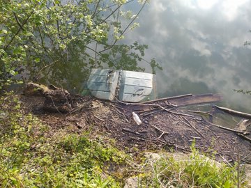
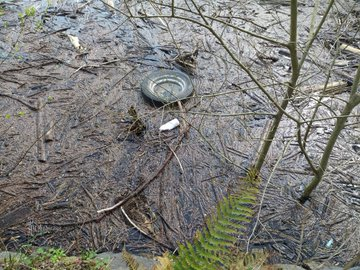

Mikroplastikoak arazoa dira. Uraren tratamenduan filtratzen dira eta zuzen-zuzenean edaten ditugu. Otsailean kamioi bat ibili zen Nuarbeko Ibar Eder urtegiaren presa inguruan garbiketak egiten. Eguraldi oso txarra zegoen. Presaren kontra zaudenak jaso zituzten, baina presatik 50 metrora zeudenak ezta ukitu ere. Aurpegia garbitu zuten?

