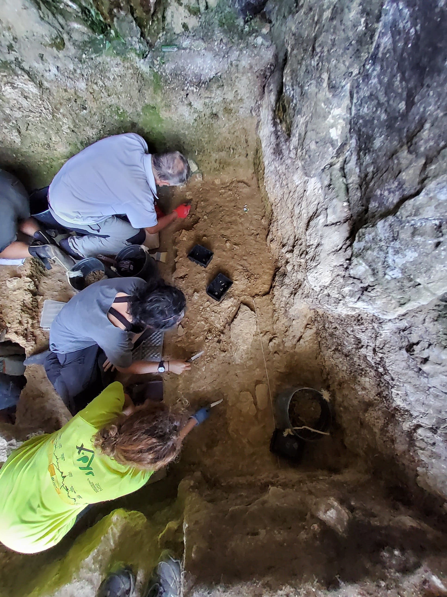
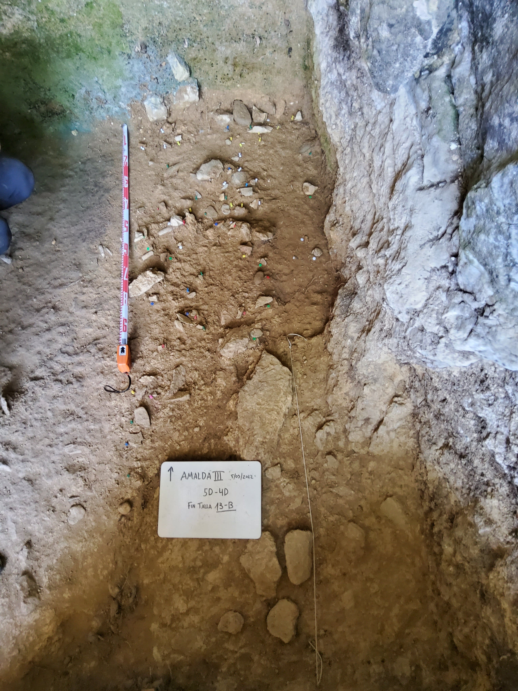
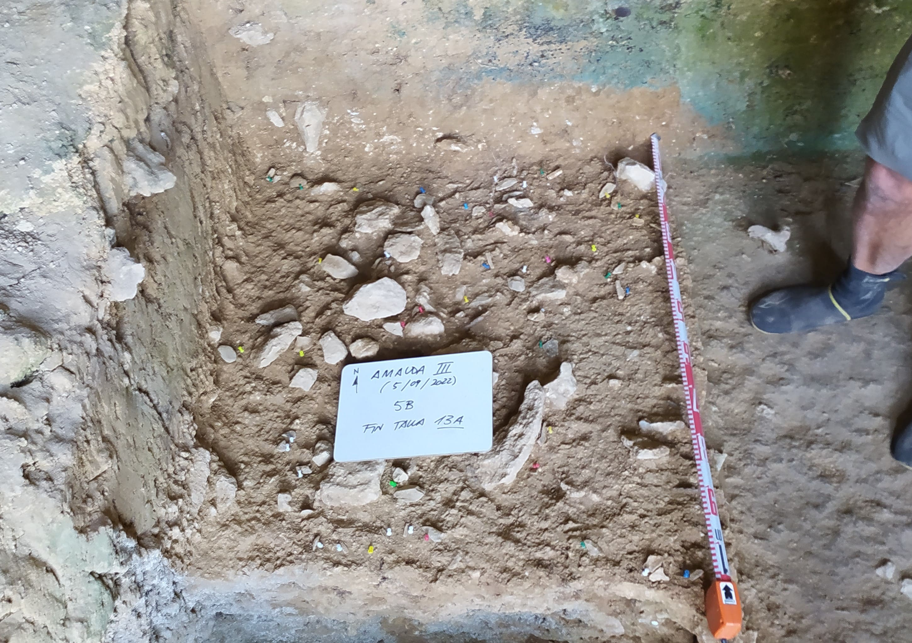
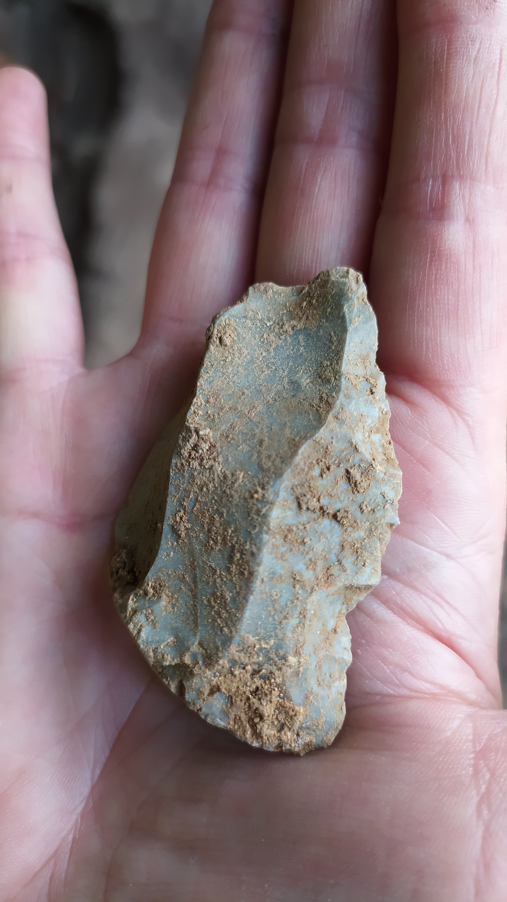
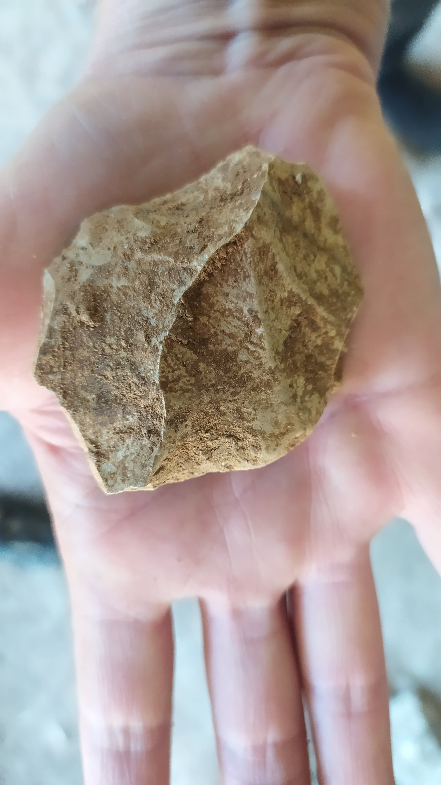
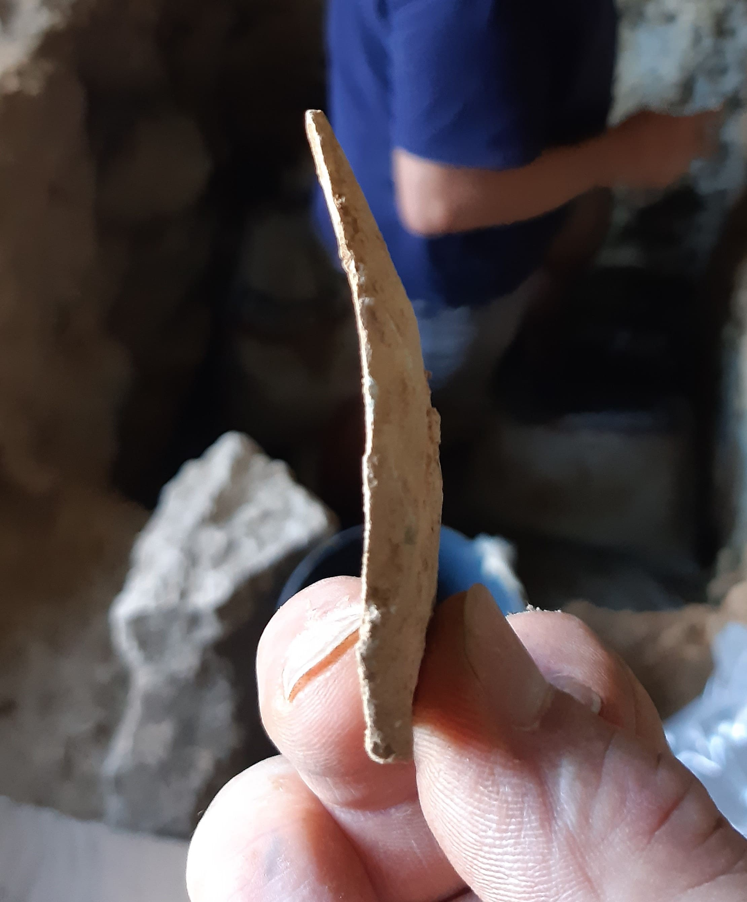

Zestoako Amalda III kobazuloko indusketa aurrera doa, eta Neanderthalen industria bikaina azaleratzen ari zaigu 13. azal honetan. Harrizko industria ugaria eta gizaki trebe haiek jaten zituzten animalia ezberdinen hezur zatiak.

Harri industria Musteriensea bezala katalogatzen den tekno kulturakoa da, baina koba honetan lantzen dituzten teknikek badauzkate beren berezitasunak ere.

Aipagarria da erabiltzen dituzten materialak mota ezberdinetakoak direla, eta batzuk gertukoak izan arren, nahiko urrutikoak ere azaltzen dira.  

