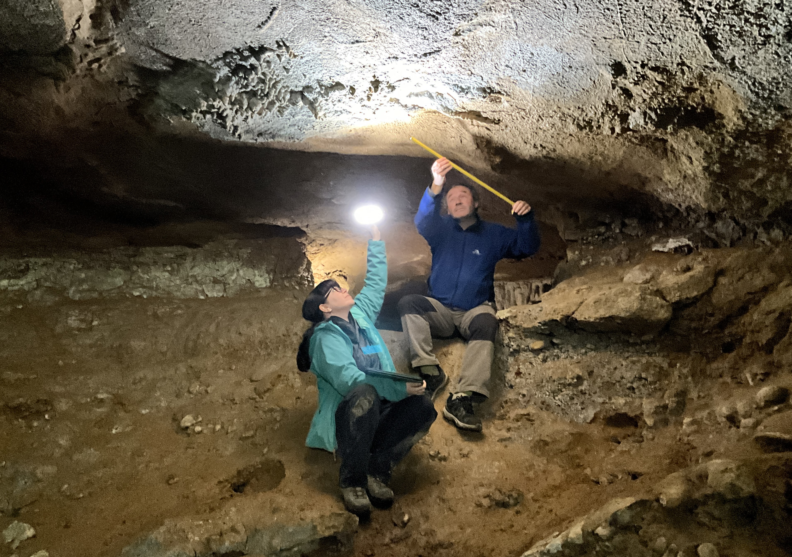
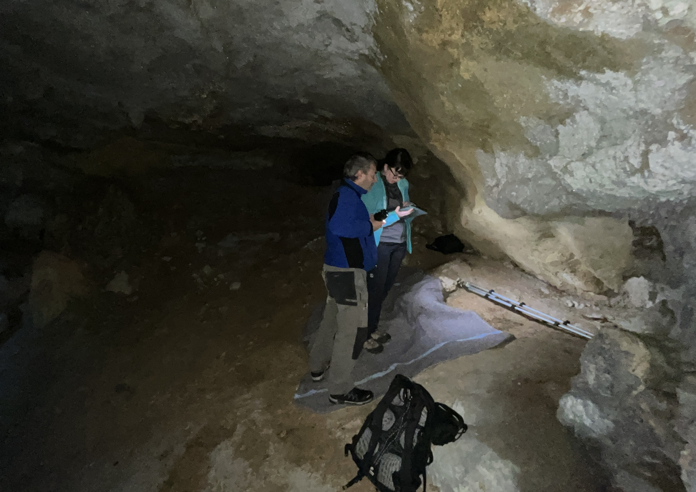
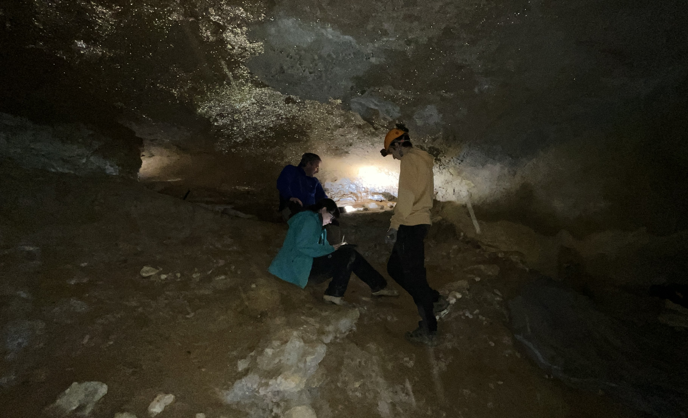
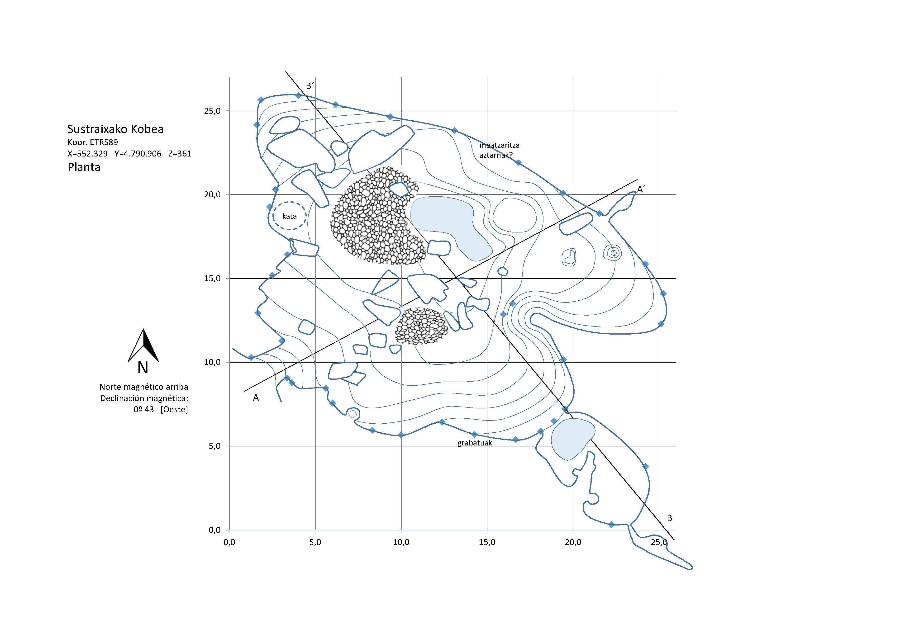

2024an lanean jarraitzen dugu Antxieta arkeologi taldean, labar artearen gainean ikerketak egiten Lastur eta Itziar artean dagoen Arbil mendian.

Blanca Ochoa eta Marcos Garcia UCM unibertsitateko ikerlariek 2024an ere jarraitu dute Sustraixa edo Arbil V kobazuloan ikerketa lanak egiten, 2017an Antxietakook aurkitu genituen Paleolitoko grabatu delikatuekin lanean.

Trebezia handiz eta teknologia berriak ere erabilia, kalkoak marrazten ari dira, ikerketa argitaratzeko asmoarekin.

Lan bikaina, Blanca eta Marcos!! 👏👏

