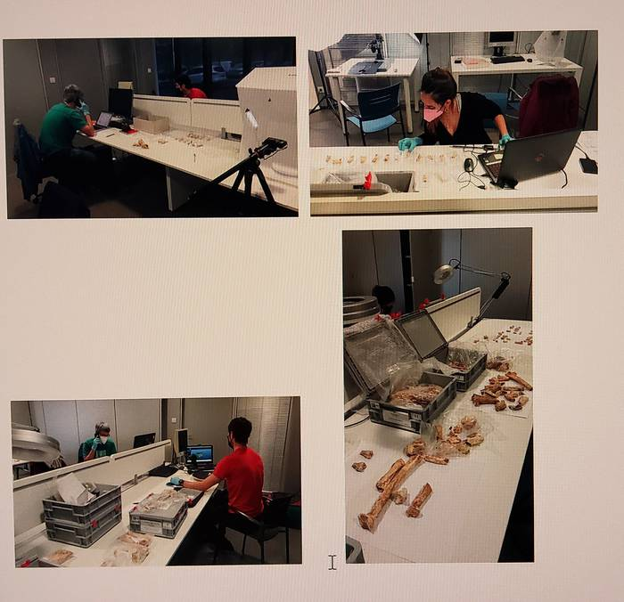
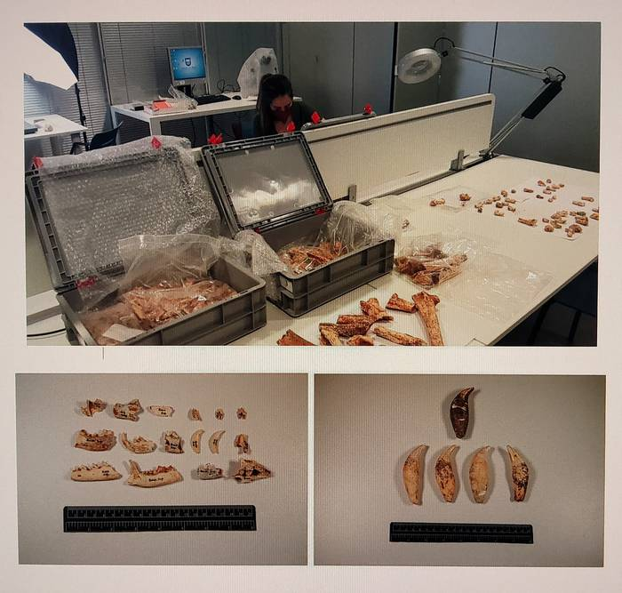

Antxieta taldeak 90eko hamarkadan egindako zundaketan aurkitutako materialen ikerketa egiten hasi da zientzialari talde bat Irungo Gordailuko depositoan.

Azken teknologiak erabiltzen dituzte ikerketa horietan. Lehenengo fase honetan zundaketan azaldu ziren animaliak aztertzen hasi dira. Espezie ezberdinen hezurren neurketekin, inbentarioarekin, makro argazkiekin, fotogrametriarekin eta 3D solidotan eskaneaketarekin ari gara orain, eta momentuan honako familia hauek desberdindu ditugu: kanidoak, ursidoak, felinoak, heinidoak, errinozeroak, belarjaleak. Fauna bikaina dago Zestoako koba honetan.

Epe laburrean zehazten joango gara identifikatzen ari garen animalien xehetasunak. Izan ere, Asier Gomez eta bere kolaboratzaileak proiektu bikaina bultzatzen hasi dira Antxieta taldearen laguntzarekin. Ikerketa hauen berri ematen joango gara.

