Urte batzuk pasatu ondoren, bueltatu egin gara Itziarko Urtiaga leizera. 1981ean zulo estu eta beldurgarri batetik sartu ginen milaka urtetan inor ibili gabeko galeria zoragarri batzuetara. Bihotzak abiadura bizian taupadaka eduki genituen, emozioz betetako hurrengo orduetan eta egunetan. Lehengo igandean, berriro emozionatu ginen hara bueltatzean.

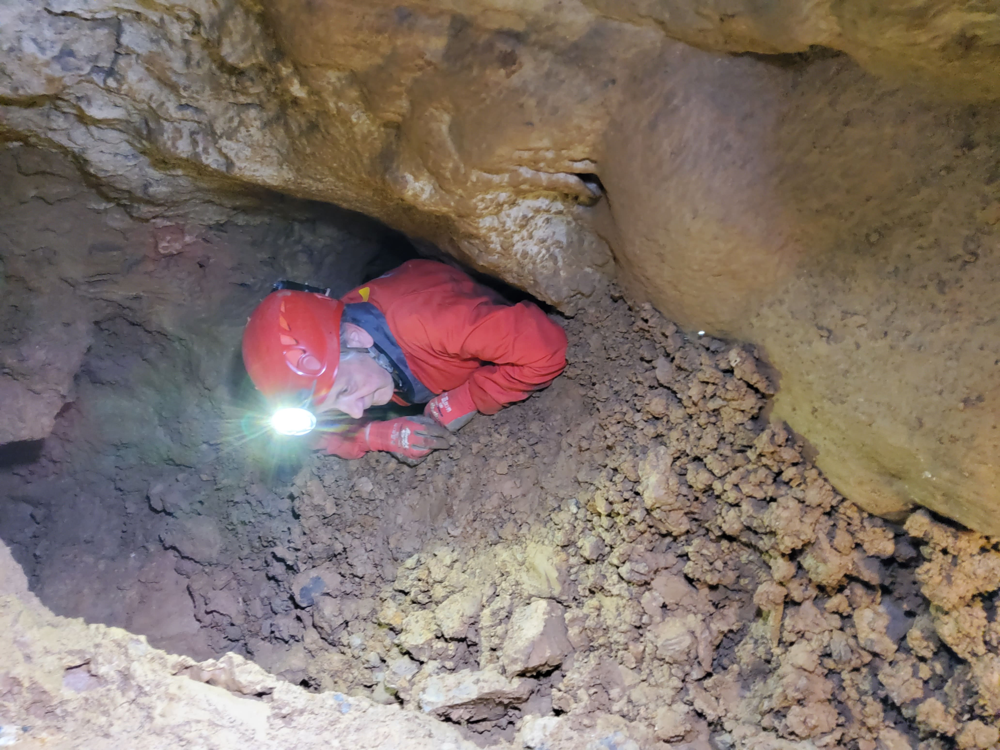
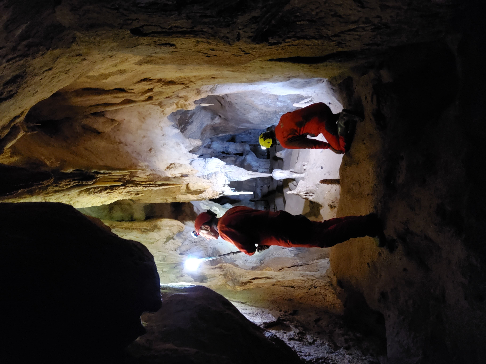
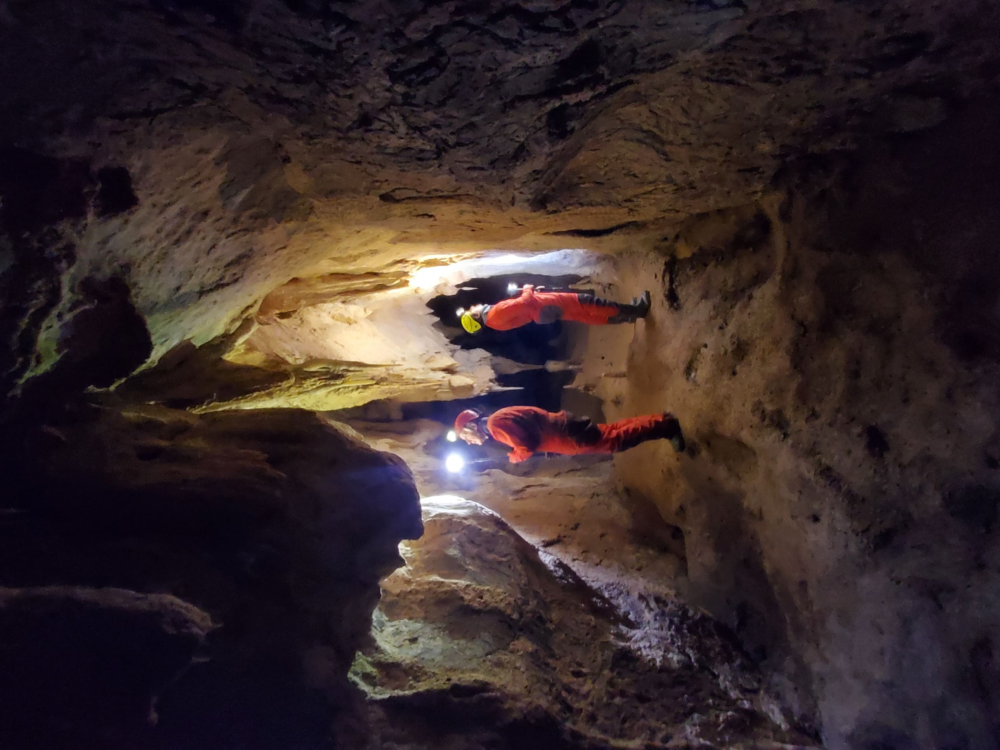
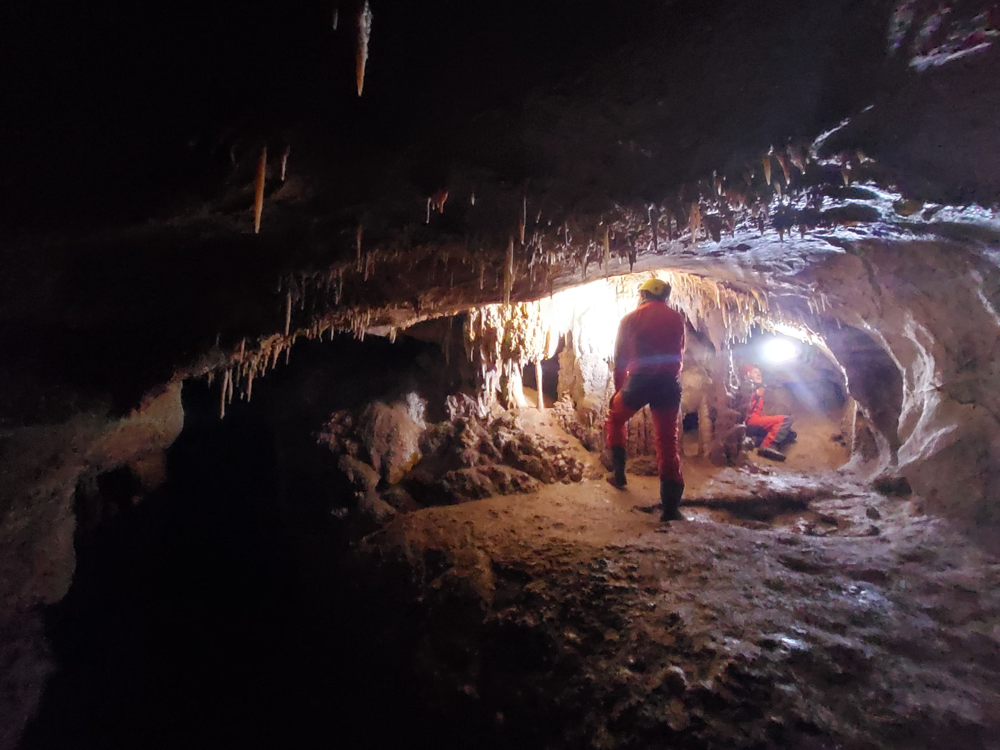

1981 eta 1983 artean bi zundaketa egin genituen Jesus Altunaren ardurapean. Orain, Irungo Gordailura joan gara, zundaketa haietan aurkitutako paleontologia eta litika bakar batzuk berrikustera eta denei argazkiak ateratzera. Benetan material bikaina dago.

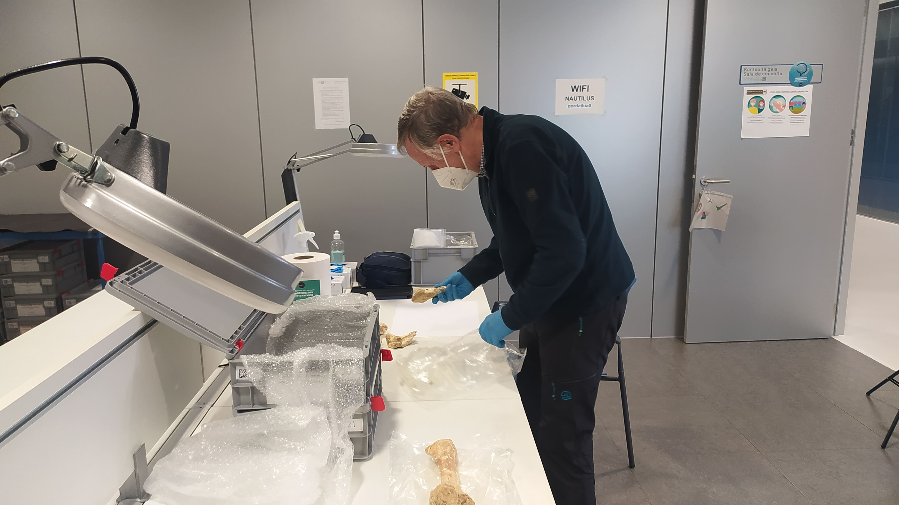
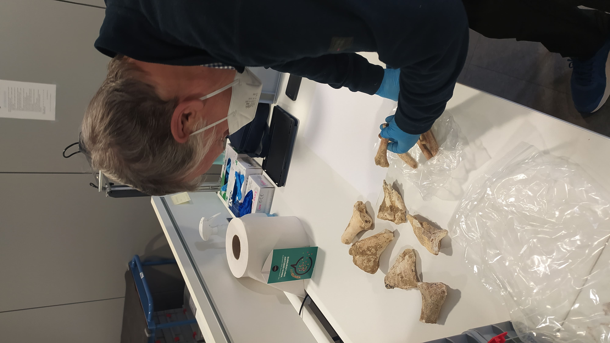
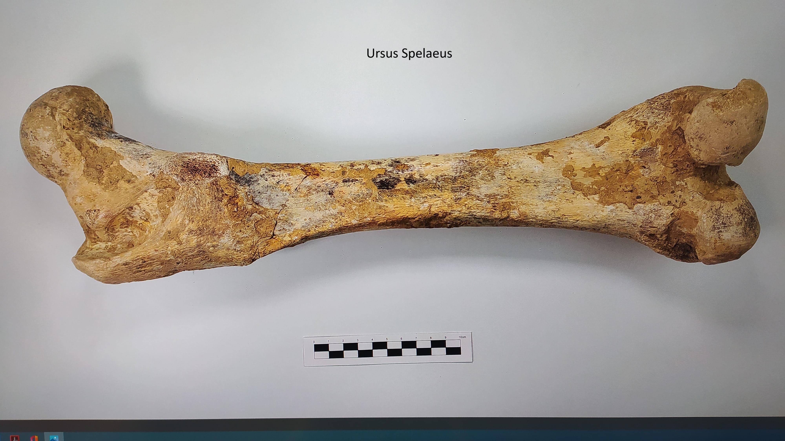
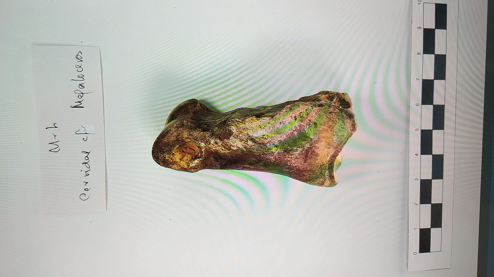

Primizia moduan, Kantauri aldeko Euskal Herriko lehen mamuta aurkitu genuen, beste zenbait espezierekin batera:

Belarjaleak :

1. Mammuthus primigenius
2. Equus ferus
3. Coleodonta antiquitatis
4. Rupicapra rupicapra
5. Ranfiter tarandus
6. Cervus elapus
7. Capreolus capreolus
8. Megaloceros giganteus
9. Lepus europaeus
10. Bos

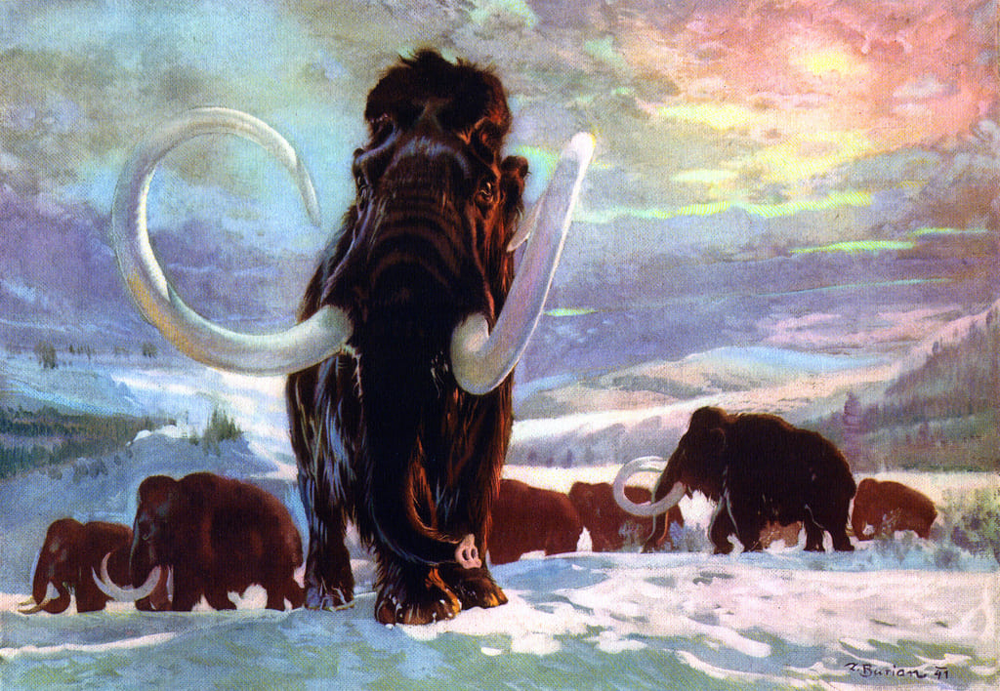
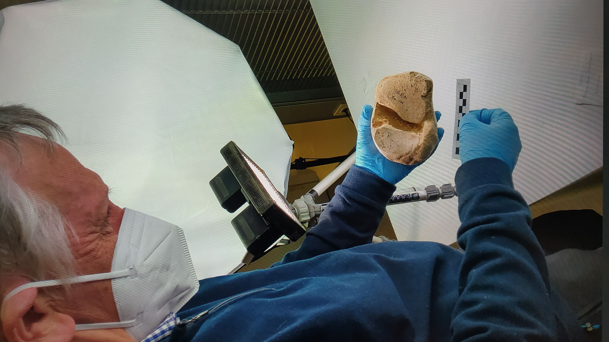
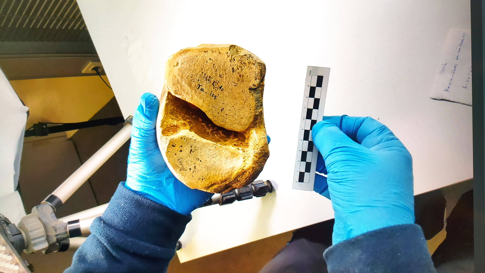
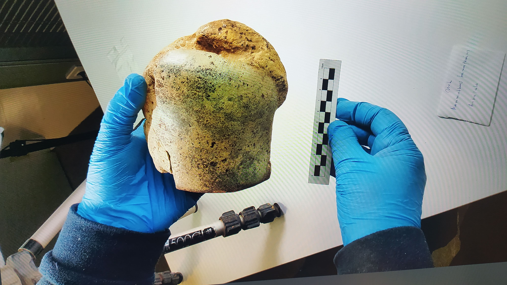

Eta haragijaleak:

11. Panthera leo
12. Crocuta crocuta
13. Canis lupus
14. Vulpes vulpes
15. Ursus spelaeus
16. Mustela
17. Meles meles

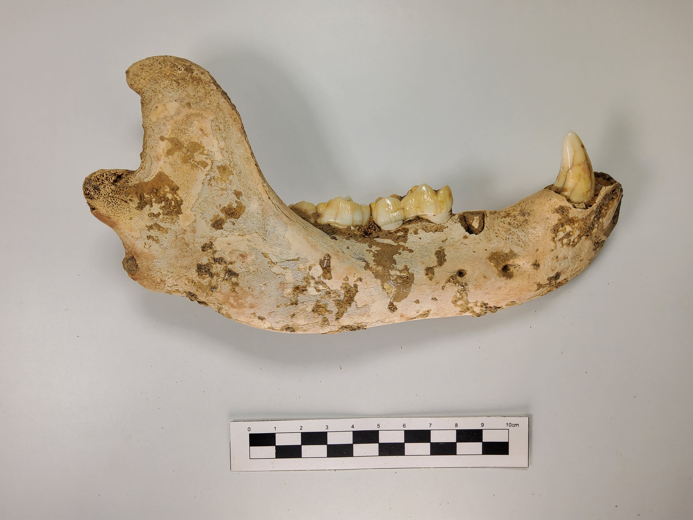
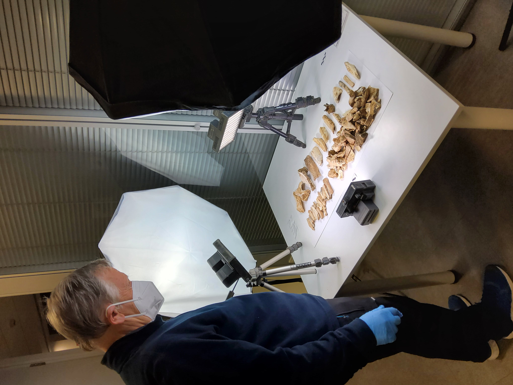
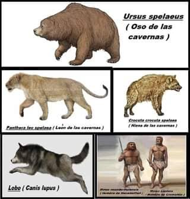
