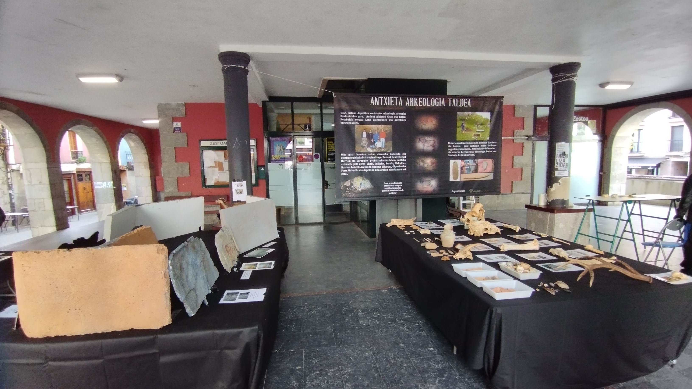
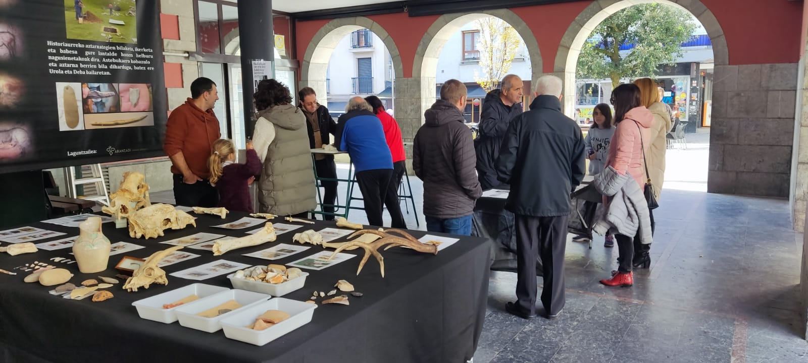

Gaur, igandea azaroak 26, Zestoarrei herriko plaza hankaz gora ipini diegu.
Goizean goiz joan gera gure traste guztiak hartuta eta plaza erdian ipini dizkiogu.

Bisontean, hartzak, hienak, lehoi nabarrak….Gizakiak, Labar Artea, arte higigorra….

Oso gustura!!

