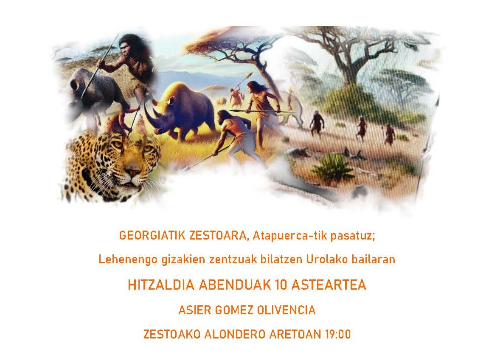
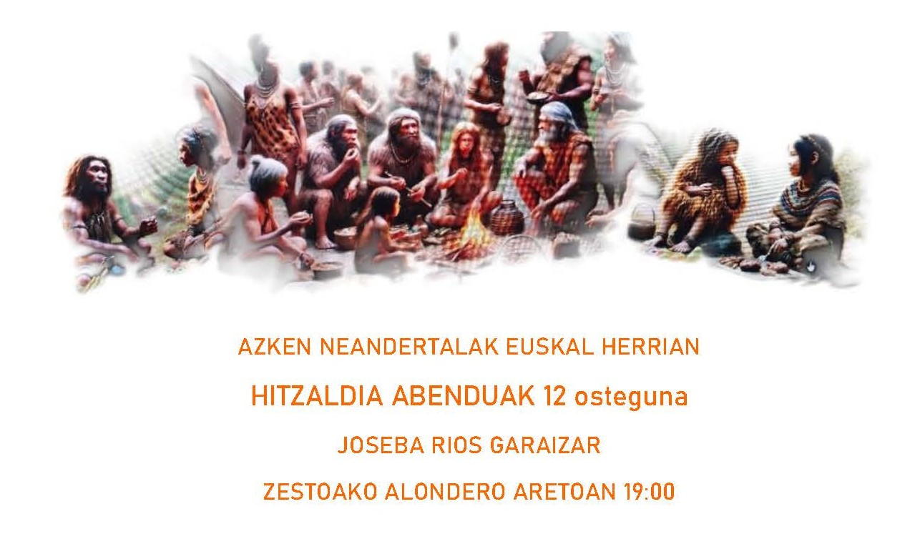
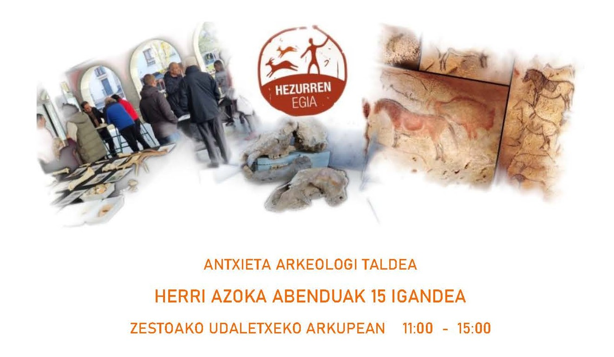

Datorren astean, guztiok Zestoara!

Abenduak 10 asteartean Asier Gomez Olivencia etorriko zaigu Urola bailarako lehenengo gizakien berri ematera, Georgiatik Zestoara, Atapuercatik pasatuz. Zestoako Alondero udal aretoan 19:00etan.
Ez galdu!

Abenduak 12 ostegunean, Joseba Rios Garaizar izango dugu Euskal Herriko azken Neandertalen inguruko hitzaldia ematen. Zestoako Alondero udal aretoan 19:00etan.
Non galdu ote ziren Euskal Herriko azken Neandertalak?🤔

Abenduak 15 igandea izango da azken eguna. Herri Azokan aurkituko gaituzue, herriko plazan goizeko 11:00etatik 15:00arte.
Animatu!

