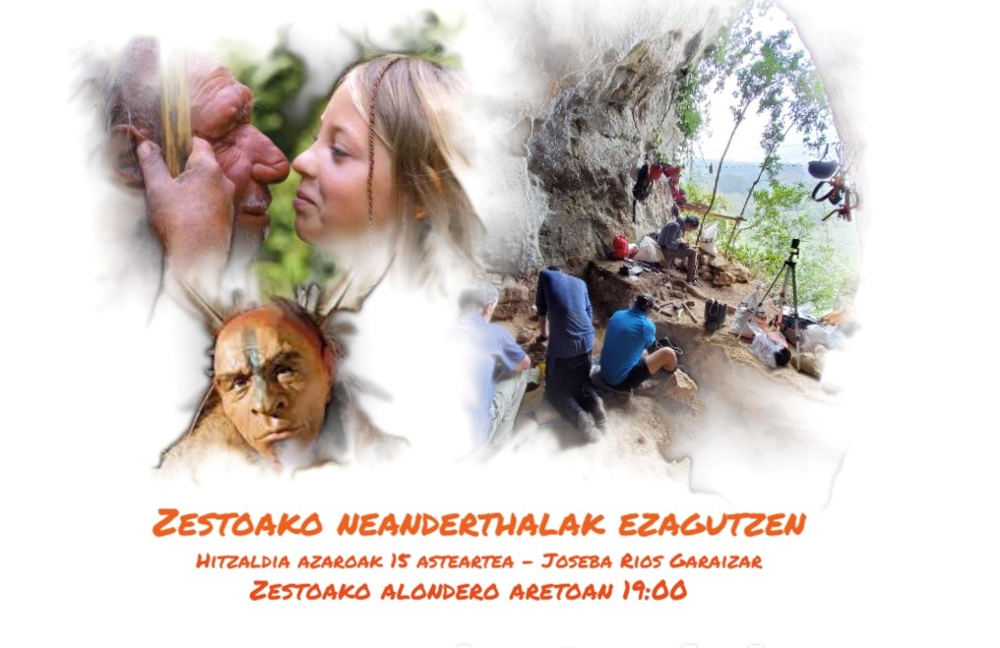
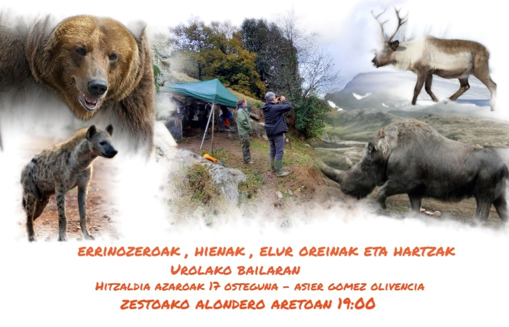
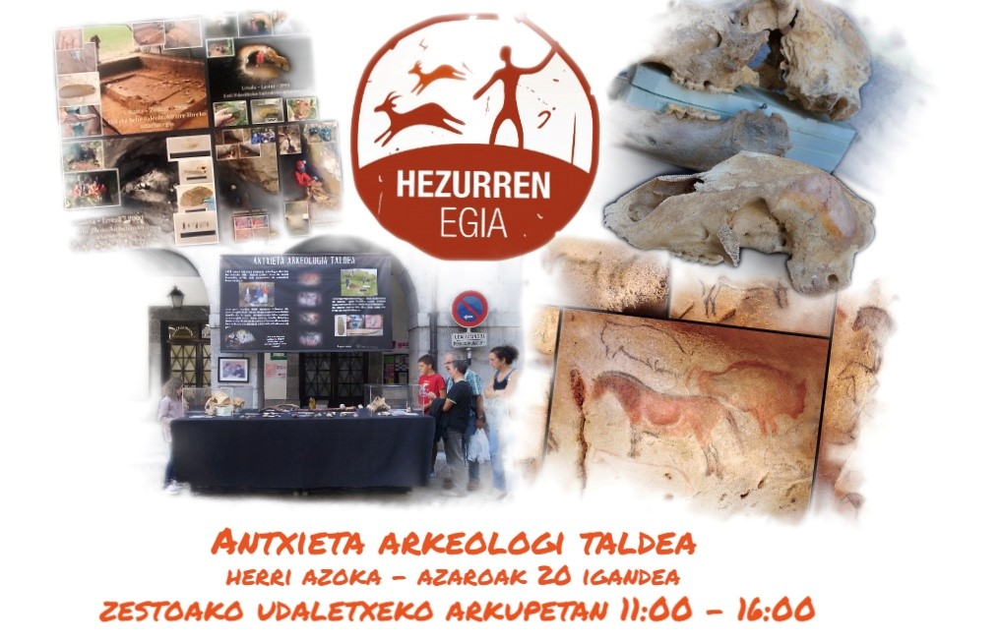

Hilaren 15ean, asteartez, hasiko da Zestoako Arkeologia Astea, eta Joseba Rios arkeologoak Amalda III, **Altzolarats (Zestoa): Zestoako Neanderthalak ezagutzen** hitzaldia eskainiko du, 19:00etan, Alondero udal aretoan.

Joseba Riosek, Bizkaiko Arkeologi Museoko ikerlaria, indusketa kanpaina oso emankorra zuzendu du Amaldako haitzuloan. Gipuzkoan oso gutxi dira neandertalen presentzia frogatua izan den aztarnategiak, eta hau da horietako bat. Bertan, Erdi Paleolitoan ondo kontserbatutako okupazio-maila dagoela egiaztatzen duten faunaren laginak eta harrizko industriaren aztarnak berreskuratu dira.

Amaldako aztarnategiko gai interesgarri eta eztabaidatuena zera da: bertan aurkitutako fauna-aztarnen jatorria. Neandertalek ehizatutako produktua da, ia esklusiboki? Edo aztarnategia beste animalia haragijaleen zulo bat zen, gizakiek noizbehinka erabiltzen zutena? Ea zer dioen Riosek hitzaldian.

Hilaren 17an, ostegunez, Asier Gomez Zestoako Baio eta Amabiturrietako aztarnategiez arituko da, 19:00etan  Alondero udal aretoan, honako saio honetan: **Errinozeroak, hienak, elur-oreinak eta hartzak Urolako Bailaran? Zestoako Baio eta Amabiturrietako aztarnategiak**.

Baioko aztarnategiak (Zestoa) zeresan ugari emango du etorkizunean, hitzaldiaren tituluan suma daitekeen bezala. Asier Gomez EHU Euskal Herriko Unibertsitateko eta Aranzadi Zientzia Elkarteko ikertzailea da proiektuaren zuzendaria, eta zientzialari talde bikain bat bildu du Baioko eta Amabiturrietako (Zestoa) aztarnategiak ikertzeko. Antxieta Arkeologia taldekoek, 1990ean eta 1998-1999 bitartean, zundaketa bat egin zuten Baion, eta orain ikerketa sakonagoa egitea da helburua. Momentuz dakiguna da Gipuzkoako faunarik zaharrena dagoela koba honetan, baina zalantzarik gabe, beste ezusteko pozgarriren bat emango du aztarnategiak, eta Asier Gomezek hitzaldian ere bai seguruenik.

Azaroaren 20an, igandean, Antxieta Arkeologi Taldeak herri azokarekin itxiko du egitasmoa udaletxeko arkupetan 11:00etatik 15:00etara, **Historiaurrea Zestoan eta inguruko bailaratan** izenpean.

Antxieta Arkeologi Taldea aski ezaguna da gure artean, Andoni Albizuri eta Rafael Rezabalek 1965ean sortu zutenetik, besteak beste, Ekaingo haitzuloa eta bertako margoak aurkitu zituztelako. Beren lana historiaurreko arrastoen aurkikuntzara bideratzen da, bai haitzuloetan, baita aire librean ere. Gure inguruetako haran eta mendietan miaketak eta zundaketak egitea, laginak eta materialak analizatzea eta azterketa orokor bat egitea da, asko laburtuz, beren lana. Lan hori arkeologo adituen zuzendaritzapean eta elkarlanean egiten dute. 

Gure inguruan aurkitutako aztarnategi ia gehienak beren etengabeko lanari esker izan dira, eta emaitza, erakusketan ikusiko den bezala, ikaragarrizkoa da. Askotan ez dute esker handirik jasotzen gizartearen partetik baina gure historiaurrearen ikerketa eta babesari sekulako ekarpena egin diote mende erdi honetan zehar.
