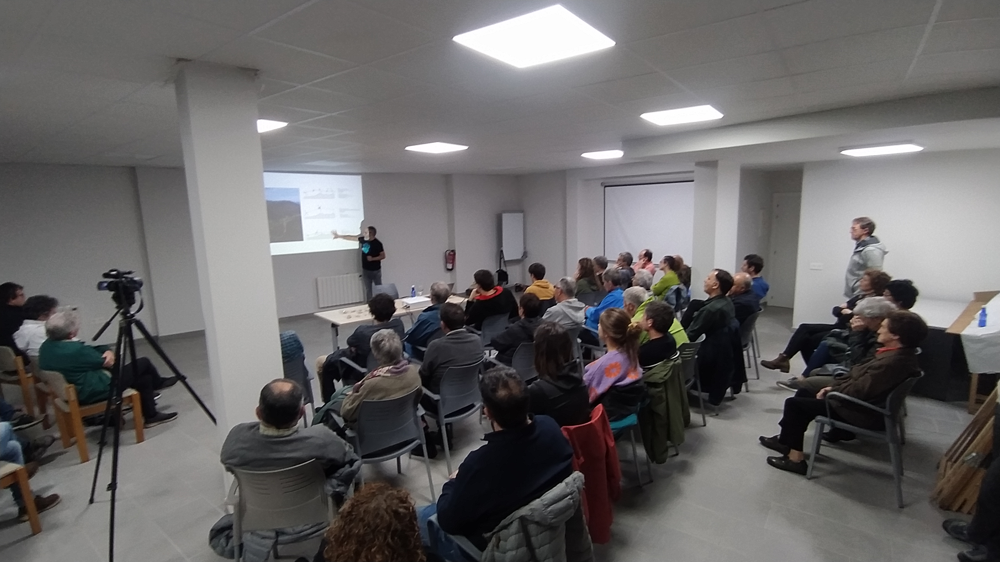
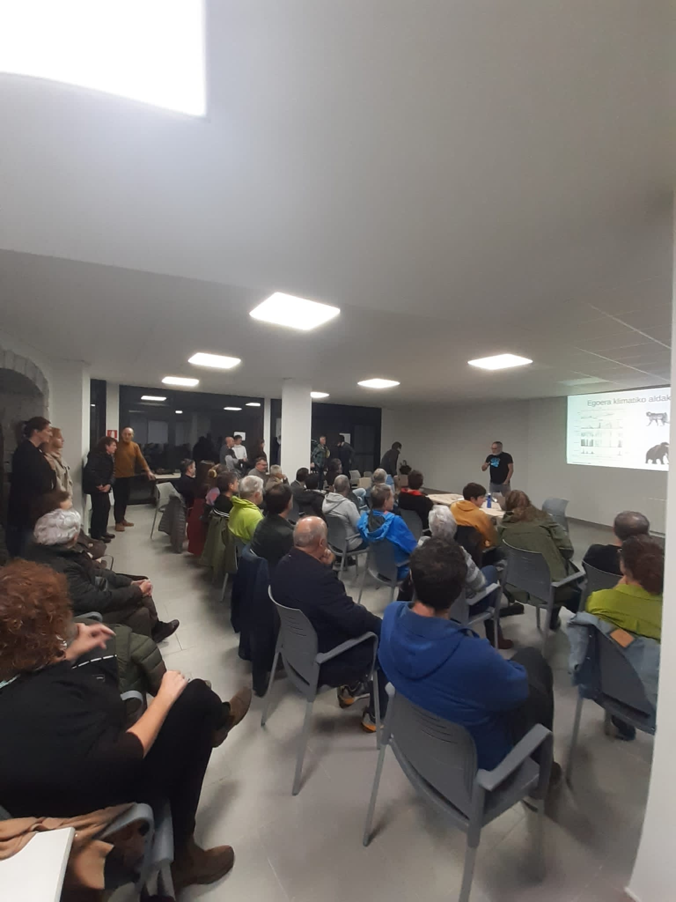
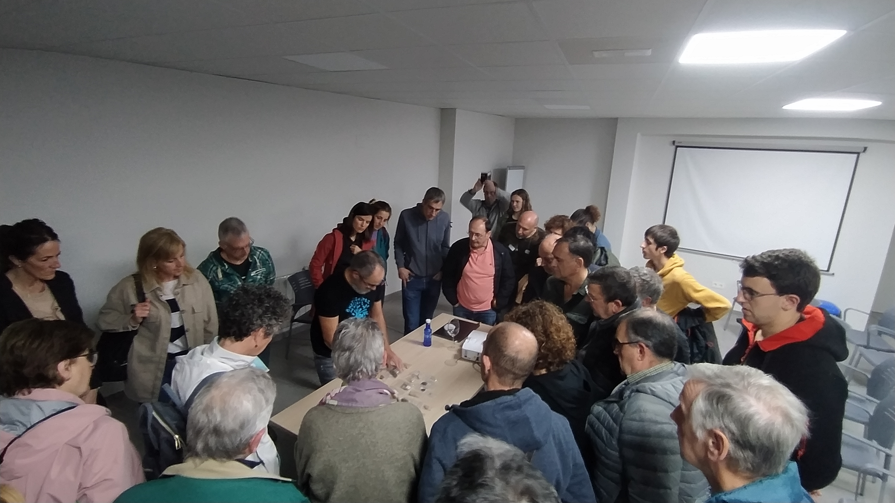
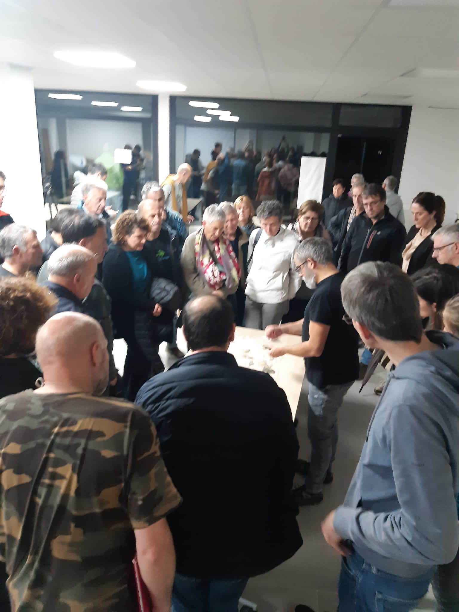

Atzo, azaroak 15, “Zestoako Neanderthalak ezagutzen“ hitzaldia eman zigun Joseba Riosek Zestoan. Bertan kontatu zizkigun Josebak Zestoako Neanderthalen sekretu guztiak. Aukera bikaina eduki genuen Joseba Riosekin, Altzolarats bailarako Neanderthalen tartean murgiltzeko. Amalda I eta Amalda III kobazuloetan egindako lanak azaldu zizkigun.

Oso-oso atsegina!

Dena tope!

