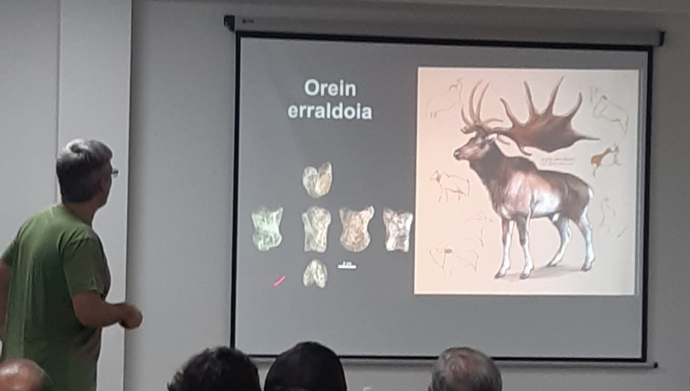
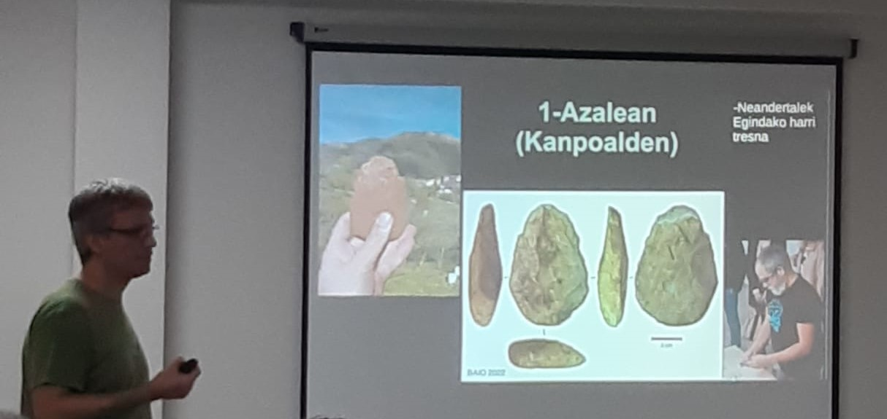
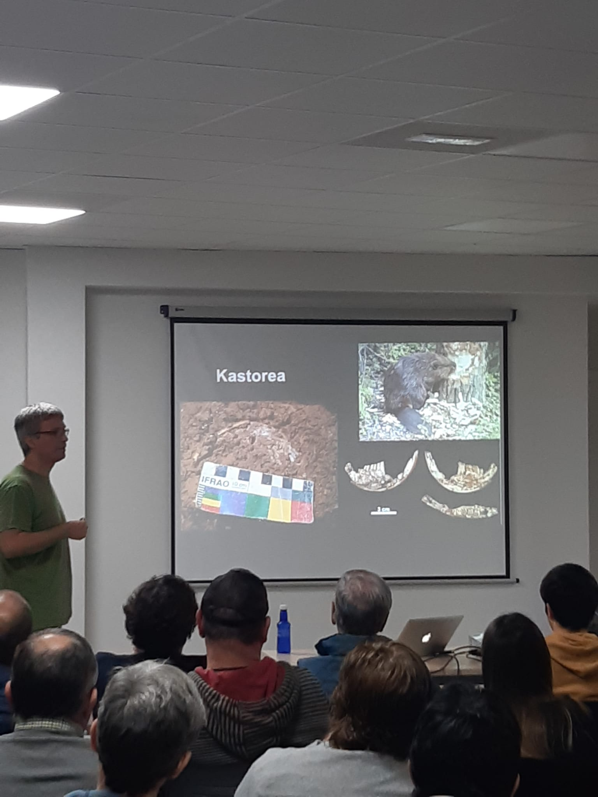
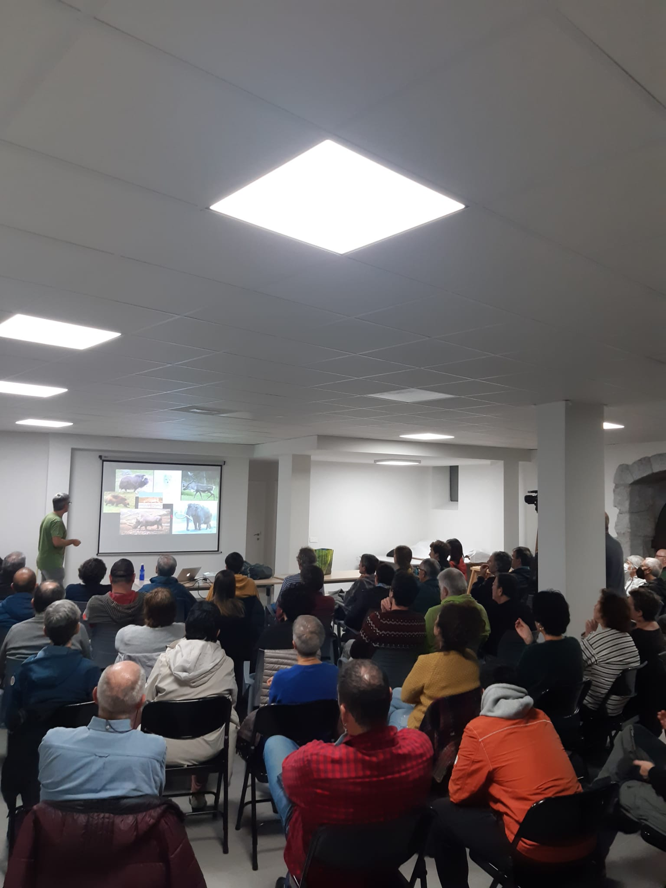

Atzo, azaroak 17, “Errinozeroak, hienak, elur oreinak eta hartzak Urolako bailaran“ hitzaldia eman zigun Asier Gomez Olivenciak Zestoan. Aukera bikaina izan genuen Zestoan, Asier Gomez-ekin, Errinozeroak, hienak, elur oreinak eta hartzak, Urolako bailaran gizakiarekin biziraupenagatik lehiatzen ziren garaietara eraman gintuen bere hitzaldiarekin. Baio eta Amabiturrieta kobazuloetan egindako lanak azaldu zizkigun.

Asierrek ordubetez mutututa eduki gintuen entzuleak.

Hipnotizatuak!

Hitzaldi mundiala, beteta!

