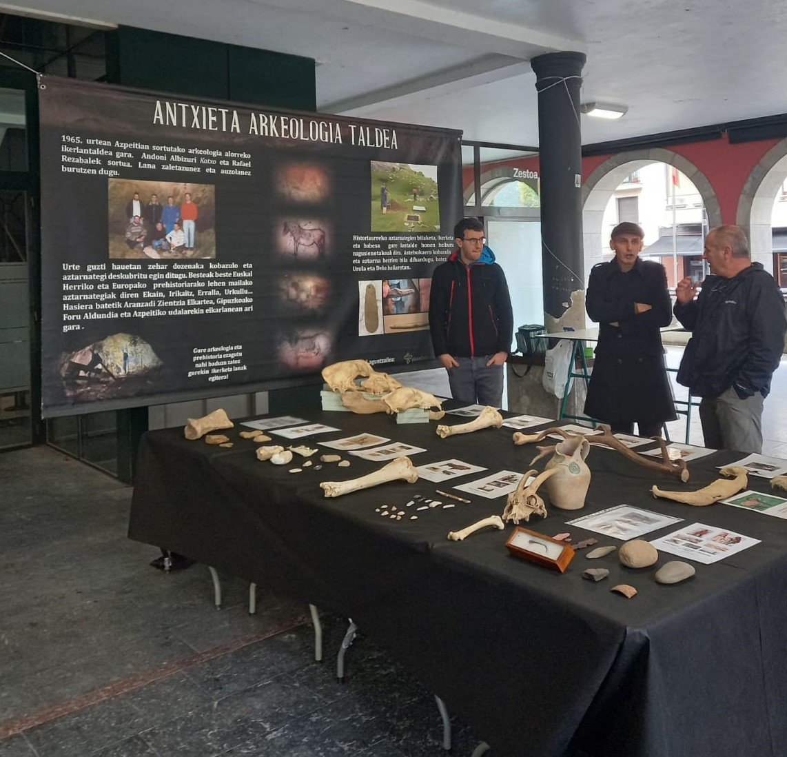
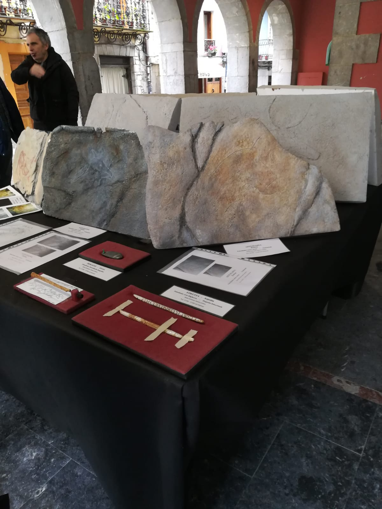
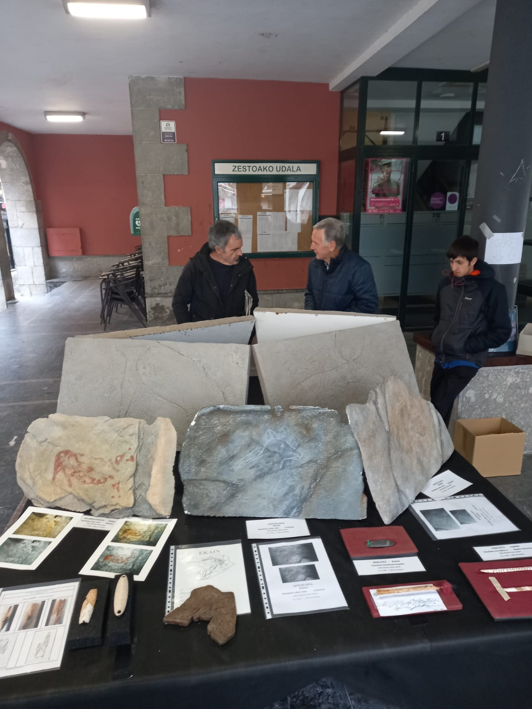
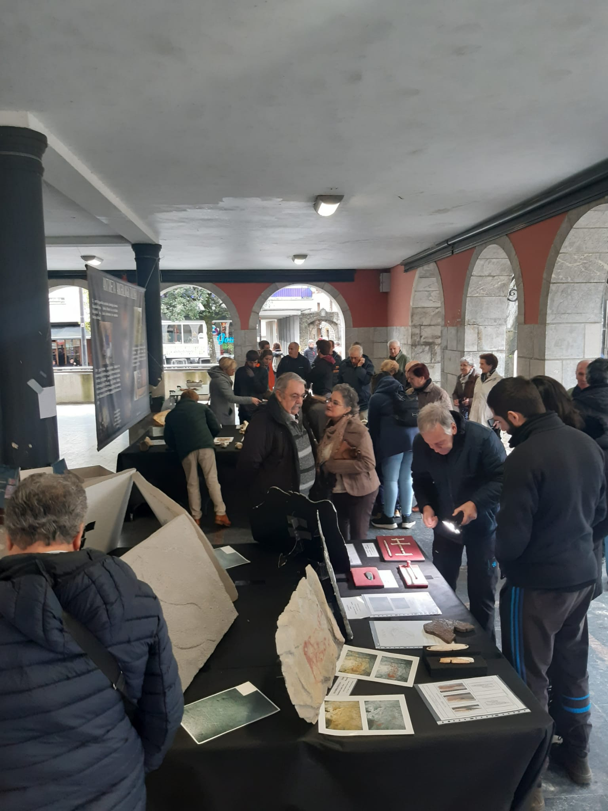

Igande honetan, azaroak 20, Zestoan Herri Azoka eduki dugu.

Kriston giroa eduki dugu Zestoako plazan.

Herritarrak ez dira gelditu ere egin, galdera bat bestearen atzetik, dena jakin nahian.

Eta gu gustura matraka galanta sartzen denei.



Herritarrak murgildu egin dira azokan, eta alde berean prehistorian !!

Gehiagotan egin beharrekoa horrelakoak, zientzia herriari !!

Datorren urtera arte Zestoa !!

