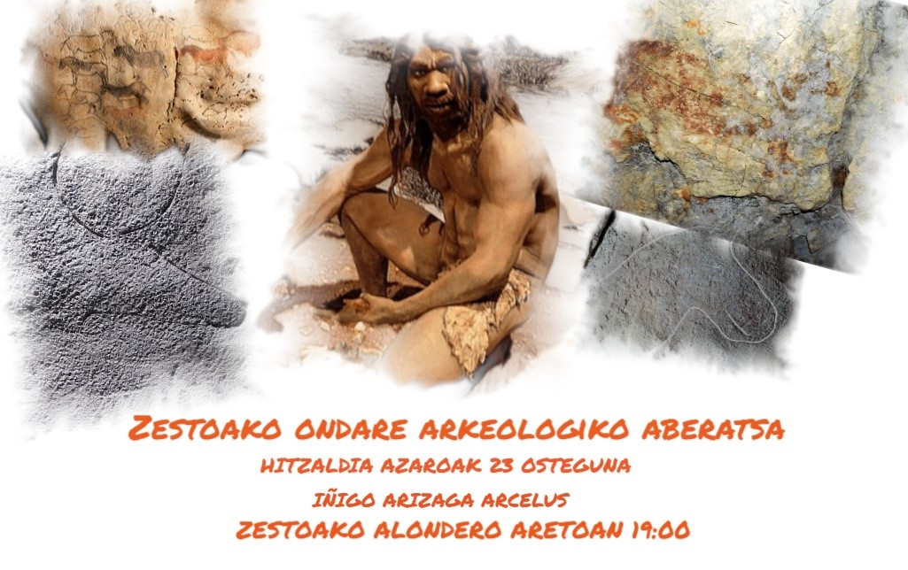
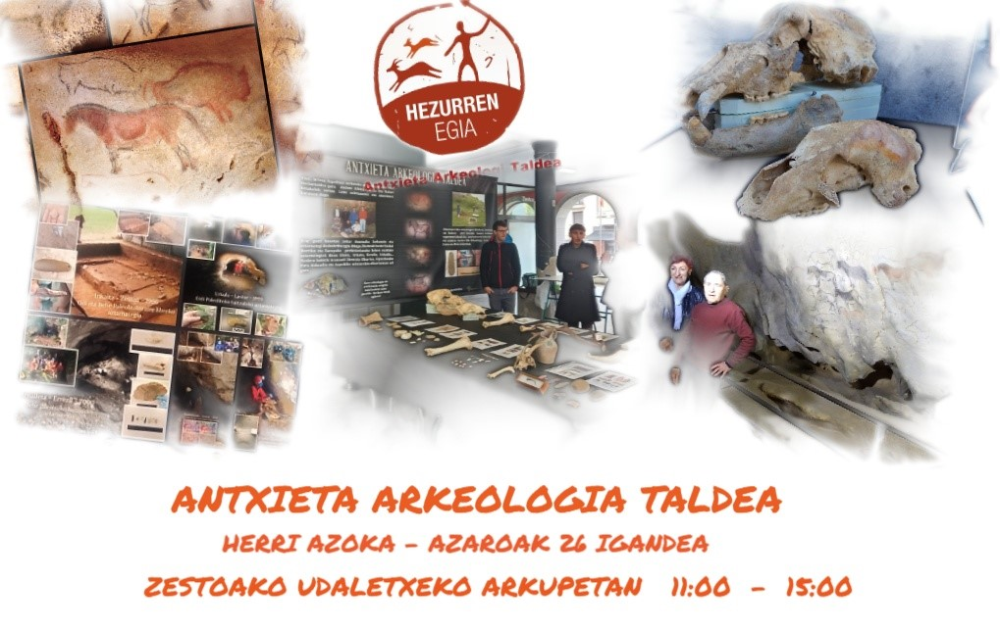

Hitzaldiak, azaroak 21 asteartea eta 23 osteguna, Zestoako Alondero aretoan, ordua: 19:00

Herri Azoka, azaroak 26 igandea, ordua: 11:00etatik 15:00ra  

Datorren aste honetan aurrehistorian murgilduko gera buru eta belarri.

Zatoz Zestoara eta gozatu.

**Azaroak 21, asteartea, 19:00. Alonderoko udal aretoa.**

**Hitzaldia: Neanderthalak Euskal Herrian.**

**Hizlaria: Joseba Rios Garaizar eta Asier Gomez Olivencia.**

Urteetan oso ideia okerra izan da neandertalei buruz, eta hominido oso primarioa eta baldarra zela uste zen, zerikusirik ez duena egungo gizakiaren (Homo sapiens sapiens) “sofistikazioarekin”. Azken hamarkadetan, ordea, ikerketa eta aurkikuntza berriek erakutsi dute hori ez dela horrela. Gaur egun, neandertalak giza talde desberdin gisa ikusten dira, bai, baina egungo gizakien eboluzio-kategoria berarekin.

Iazko hitzaldietan Zestoan izan genituen Joseba Rios eta Asier Gomez ikerlariek, argibide asko eman ditzakete zentzu horretan. Lehengoak indusketa kanpaina oso emankorra zuzendu du Amalda-III haitzuloan (Altzolarats). Gipuzkoan oso gutxi dira neandertalen presentzia frogatua izan den aztarnategiak, eta hau da horietako bat. Bertan, Erdi Paleolitoan ondo kontserbatutako okupazio-maila dagoela egiaztatzen duten faunaren laginak eta harrizko industriaren aztarnak berreskuratu dira.

Gomez, berriz, Baioko aztarnategian (Zestoa) dabil buru-belarri. Etorkizunean zeresan ugari emango du aztarnategi horrek. Momentuz dakiguna da Gipuzkoako faunarik zaharrena dagoela koba horretan.
Riosek eta Gomezek, biak elkarlanean, ikerketa eta argitalpen ugaritan parte hartu dute, eta gure inguruarekin lotura zuzena dute, besteak beste, “Amalda eta Amalda III. Habitat neandertala Altzolarats haranean” deritzanak eta Amabiturrietako zein Baioko kobari buruzko ikerketak.

**Azaroak 23, osteguna, 19:00. Alonderoko udal aretoa.**

**Hitzaldia: Zestoako ondare arkeologiko aberatsa: Ikuspegi orokor bat.**

**Hizlaria: Iñigo Arizaga Arcelus**

Ondare arkeologiko oso aberatsa du gure udalerriak, eta horri Sastarrain aldekoak gehituz gero dozenaka kobazulo eta aztarnategi daukagu. Paleolito garaikoak dira asko, baina baita Kalkolitiko, Brontze eta Burdin garaiko ugari ere. Batzuk oso ezagunak, beste batzuk oharkabean pasatzen zaizkigunak. Iñigo Arizagak eskainiko duen ikuspegi orokor horrek gure ondarea gehiago ezagutzera eramango gaitu, eta hortik sentsibilizatzera eta daukagun altxorra zaintzera.

**Azaroak 26, igandea, 11:00 – 15:00. Udaletxeko arkupetan.**

**Historiaurrea Zestoan eta inguruko bailaratan. Erakustaldia herri azoka formatuan.**

**Antolatzailea: Antxieta Arkeologi Taldea.**

Antxieta Arkeologi Taldea aski ezaguna da gure artean, Andoni Albizuri eta Rafael Rezabalek 1965ean sortu zutenetik, besteak beste, Ekaingo haitzuloa eta bertako margoak aurkitu zituztelako. Beren lana historiaurreko arrastoen aurkikuntzara bideratzen da, bai haitzuloetan, baita aire librean ere. Gure inguruetako haran eta mendietan miaketak eta zundaketak egitea, laginak eta materialak analizatzea eta azterketa orokor bat egitea da, asko laburtuz, beren lana. Lan hori arkeologo adituen zuzendaritzapean eta elkarlanean egiten dute.

Gure inguruan aurkitutako aztarnategi ia gehienak beren etengabeko lanari esker izan dira, eta emaitza, erakusketan ikusiko den bezala, ikaragarrizkoa da. Askotan ez dute esker handirik jasotzen gizartearen partetik baina gure historiaurrearen ikerketa eta babesari sekulako ekarpena egin diote mende erdi honetan zehar.
