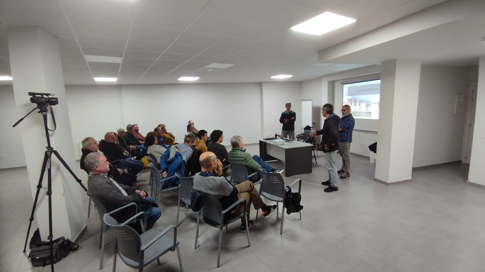
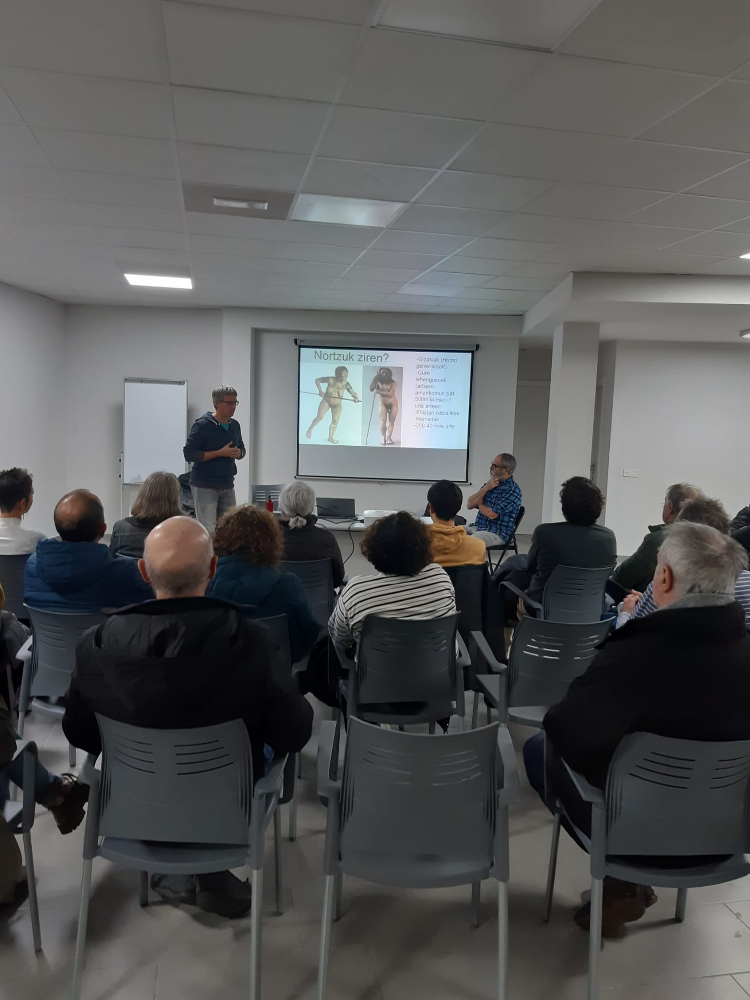
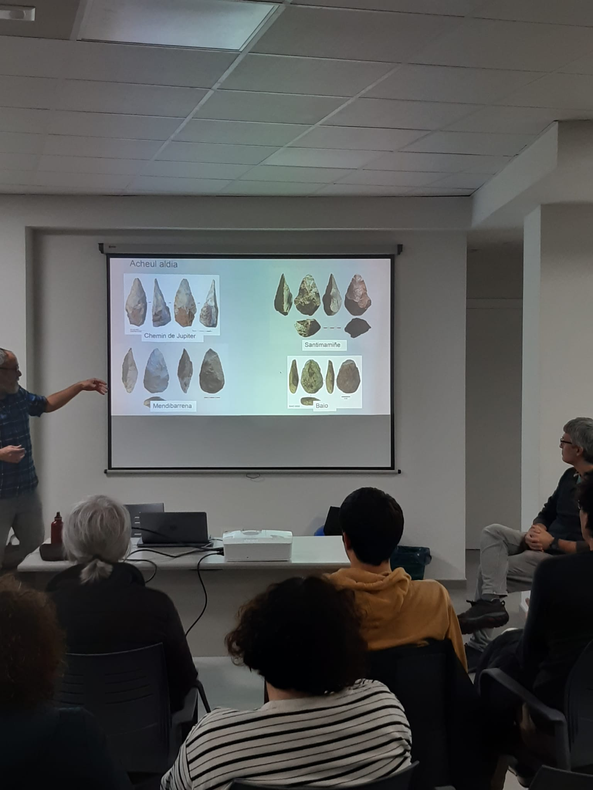

Atzo asteartea, Zestoako udalak eta Antxieta taldeak antolatutako Arkeologia astearen barruan lehenengo hitzaldia eduki genuen, Joseba Rios eta Asier Gomez genituela hizlari lanetan.
Neandertaletaz blai eginda irten genuen, benetan bikaina izan zen !!

