Gipuzkoako Foru Aldundiaren lanerako baimena jaso dugu, Zestoako Amabiturrieta koba garrantzitsuaren ikerketarekin aurrera jarraitzeko. Asier Gomez Olivenciaren zuzendaritzapean egingo dira ikerketa horiek.

Asteartean, abuztuaren 17an, proiektu honen geologia ardura duen EHUko Martin Arriolabengoarekin egin genuen lanaldia.

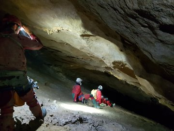
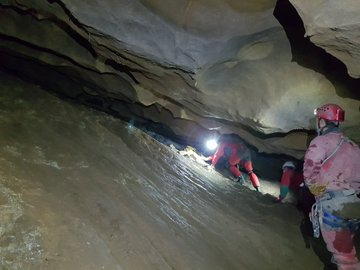
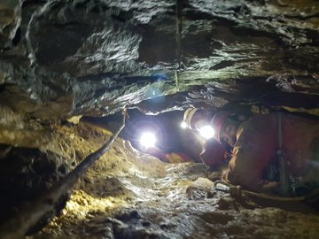
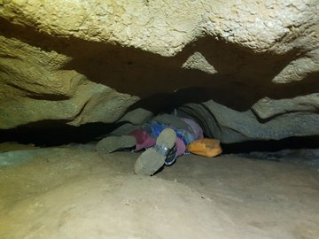

Espeleo lan gogorra eskatzen du ikerketa honek kobak duen tipologiagatik. Kobak Aizarna eta Akuako uraren surgentzia bezala funtzionatzen du, Urola ibaira irteerarekin. Buztin ugari dago bere galerietan, eta pegamentuarekin bezala itsatsita gelditzen zera, ez aurrera eta ez atzera.

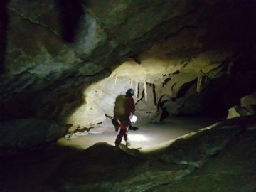
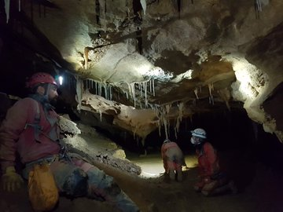
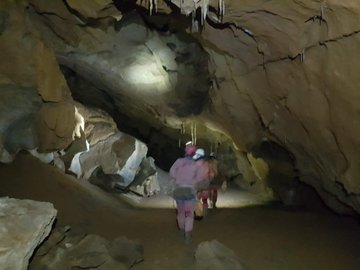
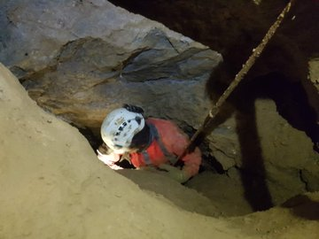

Kostatuta aztarnategia dagoen lekura iritsi eta berehala hasi ginen lanean: Asier faunarekin eta Martin sedimentazioarekin.

Momentuan ez daukagu gehiago kontatzerik, baina epe motzean zin egiten dugu xehetasun gehiagorekin azalduko ditugula aurkikuntzak.

Lan bikaina, Asier eta Aitor! Ez zarete makalak!

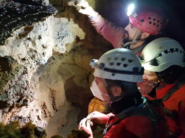
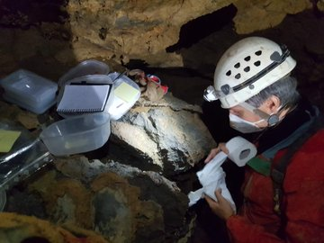
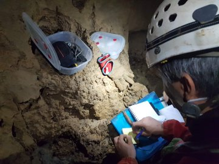
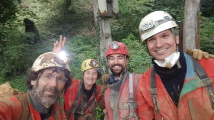
