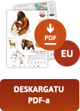
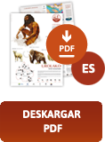
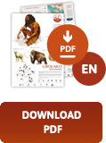
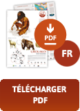

Bertan Gu izan aurretik, gizakia gutxienez 300.000 urtez bizi izan da Urola bailaran. Klima eta ingurua aldizka aldatuz joan dira epe luze horretan, eta Urolako lehen gizakia lehoi, elefante, hiena, makako eta bestelako piztien artean bizi izan zen. Milaka urte geroago, Izotz Aroan zehar, orduko gizakiak mamutekin, errinozero iletsuekin, bisonteekin, eta kobetako hartz, lehoi eta hienekin partekatu zuen lurralde hau. Duela 40.000 urte, gu bezalakoa zen gizakiak hotzaldirik latzena gainditzea lortu zuen bizimodu ehiztari-nomadari esker, eta klima hobetzean, azkenean, nekazari eta abeltzain bilakatu zen duela 7.000 urte, bere lurraldean finkatuz.

  
  
  
  

