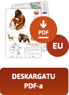
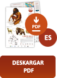
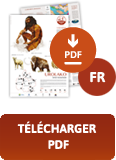

Bertan Gu izan aurretik, gizakia gutxienez 300.000 urtez bizi izan da Urola bailaran. Klima eta ingurua aldizka aldatuz joan dira epe luze horretan, eta Urolako lehen gizakia lehoi, elefante, hiena, makako eta bestelako piztien artean bizi izan zen. Milaka urte geroago, Izotz Aroan zehar, orduko gizakiak mamutekin, errinozero iletsuekin, bisonteekin, eta kobetako hartz, lehoi eta hienekin partekatu zuen lurralde hau. Duela 40.000 urte, gu bezalakoa zen gizakiak hotzaldirik latzena gainditzea lortu zuen bizimodu ehiztari-nomadari esker, eta klima hobetzean, azkenean, nekazari eta abeltzain bilakatu zen duela 7.000 urte, bere lurraldean finkatuz.

## Posterrak

  
  
  
  

## Bideoak



 



## Ariketak

[<svg style="height: 1em" class="inline-block" xmlns="http://www.w3.org/2000/svg" viewBox="0 0 24 24"><path fill="none" stroke="currentColor" stroke-linecap="round" stroke-linejoin="round" stroke-width="1.5" d="M19.5 14.25v-2.625a3.375 3.375 0 0 0-3.375-3.375h-1.5A1.125 1.125 0 0 1 13.5 7.125v-1.5a3.375 3.375 0 0 0-3.375-3.375H8.25m0 12.75h7.5m-7.5 3H12M10.5 2.25H5.625c-.621 0-1.125.504-1.125 1.125v17.25c0 .621.504 1.125 1.125 1.125h12.75c.621 0 1.125-.504 1.125-1.125V11.25a9 9 0 0 0-9-9"></path></svg>&nbsp;Materialaren aurkezpena](media/MaterialOsagarriarenAurkezpena.pdf)

[<svg style="height: 1em" class="inline-block" xmlns="http://www.w3.org/2000/svg" viewBox="0 0 24 24"><path fill="none" stroke="currentColor" stroke-linecap="round" stroke-linejoin="round" stroke-width="1.5" d="m20.25 7.5l-.625 10.632a2.25 2.25 0 0 1-2.247 2.118H6.622a2.25 2.25 0 0 1-2.247-2.118L3.75 7.5M10 11.25h4M3.375 7.5h17.25c.621 0 1.125-.504 1.125-1.125v-1.5c0-.621-.504-1.125-1.125-1.125H3.375c-.621 0-1.125.504-1.125 1.125v1.5c0 .621.504 1.125 1.125 1.125"></path></svg>&nbsp;Materiala deskargatu](media/MaterialDidaktikoa.zip)

### Maila erraza

<table style="overflow-x: hidden">
  <thead>
    <tr>
      <th>Erraza</th>
      <th>Ariketak</th>
      <th>Erantzunak</th>
    </tr>
  </thead>
  <tbody>
    <tr>
      <td>Galderak</td>
      <td>
        <a href="media/Erraza/Galderak1.pdf">
          <svg style="height: 1em" class="inline-block" xmlns="http://www.w3.org/2000/svg" viewBox="0 0 24 24"><path fill="none" stroke="currentColor" stroke-linecap="round" stroke-linejoin="round" stroke-width="1.5" d="M19.5 14.25v-2.625a3.375 3.375 0 0 0-3.375-3.375h-1.5A1.125 1.125 0 0 1 13.5 7.125v-1.5a3.375 3.375 0 0 0-3.375-3.375H8.25m0 12.75h7.5m-7.5 3H12M10.5 2.25H5.625c-.621 0-1.125.504-1.125 1.125v17.25c0 .621.504 1.125 1.125 1.125h12.75c.621 0 1.125-.504 1.125-1.125V11.25a9 9 0 0 0-9-9"></path></svg>
        </a>
      </td>
      <td>
        <a href="media/Erraza/Erantzunak1/Erantzunak1.pdf">
          <svg style="height: 1em" class="inline-block" xmlns="http://www.w3.org/2000/svg" viewBox="0 0 24 24"><path fill="none" stroke="currentColor" stroke-linecap="round" stroke-linejoin="round" stroke-width="1.5" d="M19.5 14.25v-2.625a3.375 3.375 0 0 0-3.375-3.375h-1.5A1.125 1.125 0 0 1 13.5 7.125v-1.5a3.375 3.375 0 0 0-3.375-3.375H8.25m0 12.75h7.5m-7.5 3H12M10.5 2.25H5.625c-.621 0-1.125.504-1.125 1.125v17.25c0 .621.504 1.125 1.125 1.125h12.75c.621 0 1.125-.504 1.125-1.125V11.25a9 9 0 0 0-9-9"></path></svg>
        </a>
      </td>
    </tr>
    <tr>
      <td>Letra Zopa - Behe Paleolitoa</td>
      <td>
        <a href="media/Erraza/Letra zopa Erraza/BehePaleolitoa1.pdf">
          <svg style="height: 1em" class="inline-block" xmlns="http://www.w3.org/2000/svg" viewBox="0 0 24 24"><path fill="none" stroke="currentColor" stroke-linecap="round" stroke-linejoin="round" stroke-width="1.5" d="M19.5 14.25v-2.625a3.375 3.375 0 0 0-3.375-3.375h-1.5A1.125 1.125 0 0 1 13.5 7.125v-1.5a3.375 3.375 0 0 0-3.375-3.375H8.25m0 12.75h7.5m-7.5 3H12M10.5 2.25H5.625c-.621 0-1.125.504-1.125 1.125v17.25c0 .621.504 1.125 1.125 1.125h12.75c.621 0 1.125-.504 1.125-1.125V11.25a9 9 0 0 0-9-9"></path></svg>
        </a>
      </td>
      <td>
        <a href="media/Erraza/Erantzunak1/BehePaleolitoa1-Zopa.pdf">
          <svg style="height: 1em" class="inline-block" xmlns="http://www.w3.org/2000/svg" viewBox="0 0 24 24"><path fill="none" stroke="currentColor" stroke-linecap="round" stroke-linejoin="round" stroke-width="1.5" d="M19.5 14.25v-2.625a3.375 3.375 0 0 0-3.375-3.375h-1.5A1.125 1.125 0 0 1 13.5 7.125v-1.5a3.375 3.375 0 0 0-3.375-3.375H8.25m0 12.75h7.5m-7.5 3H12M10.5 2.25H5.625c-.621 0-1.125.504-1.125 1.125v17.25c0 .621.504 1.125 1.125 1.125h12.75c.621 0 1.125-.504 1.125-1.125V11.25a9 9 0 0 0-9-9"></path></svg>
        </a>
      </td>
    </tr>
    <tr>
      <td>Letra Zopa - Erdi Paleolitoa</td>
      <td>
        <a href="media/Erraza/Letra zopa Erraza/ErdiPaleolitoa1.pdf">
          <svg style="height: 1em" class="inline-block" xmlns="http://www.w3.org/2000/svg" viewBox="0 0 24 24"><path fill="none" stroke="currentColor" stroke-linecap="round" stroke-linejoin="round" stroke-width="1.5" d="M19.5 14.25v-2.625a3.375 3.375 0 0 0-3.375-3.375h-1.5A1.125 1.125 0 0 1 13.5 7.125v-1.5a3.375 3.375 0 0 0-3.375-3.375H8.25m0 12.75h7.5m-7.5 3H12M10.5 2.25H5.625c-.621 0-1.125.504-1.125 1.125v17.25c0 .621.504 1.125 1.125 1.125h12.75c.621 0 1.125-.504 1.125-1.125V11.25a9 9 0 0 0-9-9"></path></svg>
        </a>
      </td>
      <td>
        <a href="media/Erraza/Erantzunak1/ErdiPaleolitoa1-Zopa.pdf">
          <svg style="height: 1em" class="inline-block" xmlns="http://www.w3.org/2000/svg" viewBox="0 0 24 24"><path fill="none" stroke="currentColor" stroke-linecap="round" stroke-linejoin="round" stroke-width="1.5" d="M19.5 14.25v-2.625a3.375 3.375 0 0 0-3.375-3.375h-1.5A1.125 1.125 0 0 1 13.5 7.125v-1.5a3.375 3.375 0 0 0-3.375-3.375H8.25m0 12.75h7.5m-7.5 3H12M10.5 2.25H5.625c-.621 0-1.125.504-1.125 1.125v17.25c0 .621.504 1.125 1.125 1.125h12.75c.621 0 1.125-.504 1.125-1.125V11.25a9 9 0 0 0-9-9"></path></svg>
        </a>
      </td>
    </tr>
    <tr>
      <td>Letra Zopa - Goi Paleolitoa</td>
      <td>
        <a href="media/Erraza/Letra zopa Erraza/GoiPaleolitoa1.pdf">
          <svg style="height: 1em" class="inline-block" xmlns="http://www.w3.org/2000/svg" viewBox="0 0 24 24"><path fill="none" stroke="currentColor" stroke-linecap="round" stroke-linejoin="round" stroke-width="1.5" d="M19.5 14.25v-2.625a3.375 3.375 0 0 0-3.375-3.375h-1.5A1.125 1.125 0 0 1 13.5 7.125v-1.5a3.375 3.375 0 0 0-3.375-3.375H8.25m0 12.75h7.5m-7.5 3H12M10.5 2.25H5.625c-.621 0-1.125.504-1.125 1.125v17.25c0 .621.504 1.125 1.125 1.125h12.75c.621 0 1.125-.504 1.125-1.125V11.25a9 9 0 0 0-9-9"></path></svg>
        </a>
      </td>
      <td>
        <a href="media/Erraza/Erantzunak1/GoiPaleolitoa1-Zopa.pdf">
          <svg style="height: 1em" class="inline-block" xmlns="http://www.w3.org/2000/svg" viewBox="0 0 24 24"><path fill="none" stroke="currentColor" stroke-linecap="round" stroke-linejoin="round" stroke-width="1.5" d="M19.5 14.25v-2.625a3.375 3.375 0 0 0-3.375-3.375h-1.5A1.125 1.125 0 0 1 13.5 7.125v-1.5a3.375 3.375 0 0 0-3.375-3.375H8.25m0 12.75h7.5m-7.5 3H12M10.5 2.25H5.625c-.621 0-1.125.504-1.125 1.125v17.25c0 .621.504 1.125 1.125 1.125h12.75c.621 0 1.125-.504 1.125-1.125V11.25a9 9 0 0 0-9-9"></path></svg>
        </a>
      </td>
    </tr>
    <tr>
      <td>Letra Zopa - Neolito Metalen Aroa</td>
      <td>
        <a href="media/Erraza/Letra zopa Erraza/Neolito-MetalenAroa1.pdf">
          <svg style="height: 1em" class="inline-block" xmlns="http://www.w3.org/2000/svg" viewBox="0 0 24 24"><path fill="none" stroke="currentColor" stroke-linecap="round" stroke-linejoin="round" stroke-width="1.5" d="M19.5 14.25v-2.625a3.375 3.375 0 0 0-3.375-3.375h-1.5A1.125 1.125 0 0 1 13.5 7.125v-1.5a3.375 3.375 0 0 0-3.375-3.375H8.25m0 12.75h7.5m-7.5 3H12M10.5 2.25H5.625c-.621 0-1.125.504-1.125 1.125v17.25c0 .621.504 1.125 1.125 1.125h12.75c.621 0 1.125-.504 1.125-1.125V11.25a9 9 0 0 0-9-9"></path></svg>
        </a>
      </td>
      <td>
        <a href="media/Erraza/Erantzunak1/Neolito-MetalenAroa1-Zopa.pdf">
          <svg style="height: 1em" class="inline-block" xmlns="http://www.w3.org/2000/svg" viewBox="0 0 24 24"><path fill="none" stroke="currentColor" stroke-linecap="round" stroke-linejoin="round" stroke-width="1.5" d="M19.5 14.25v-2.625a3.375 3.375 0 0 0-3.375-3.375h-1.5A1.125 1.125 0 0 1 13.5 7.125v-1.5a3.375 3.375 0 0 0-3.375-3.375H8.25m0 12.75h7.5m-7.5 3H12M10.5 2.25H5.625c-.621 0-1.125.504-1.125 1.125v17.25c0 .621.504 1.125 1.125 1.125h12.75c.621 0 1.125-.504 1.125-1.125V11.25a9 9 0 0 0-9-9"></path></svg>
        </a>
      </td>
    </tr>
    <tr>
      <td>Mapa</td>
      <td>
        <a href="media/Erraza/Mapa1.pdf">
          <svg style="height: 1em" class="inline-block" xmlns="http://www.w3.org/2000/svg" viewBox="0 0 24 24"><path fill="none" stroke="currentColor" stroke-linecap="round" stroke-linejoin="round" stroke-width="1.5" d="M19.5 14.25v-2.625a3.375 3.375 0 0 0-3.375-3.375h-1.5A1.125 1.125 0 0 1 13.5 7.125v-1.5a3.375 3.375 0 0 0-3.375-3.375H8.25m0 12.75h7.5m-7.5 3H12M10.5 2.25H5.625c-.621 0-1.125.504-1.125 1.125v17.25c0 .621.504 1.125 1.125 1.125h12.75c.621 0 1.125-.504 1.125-1.125V11.25a9 9 0 0 0-9-9"></path></svg>
        </a>
      </td>
      <td>
        <a href="media/Erraza/Erantzunak1/Mapa1-Erantzuna.pdf">
          <svg style="height: 1em" class="inline-block" xmlns="http://www.w3.org/2000/svg" viewBox="0 0 24 24"><path fill="none" stroke="currentColor" stroke-linecap="round" stroke-linejoin="round" stroke-width="1.5" d="M19.5 14.25v-2.625a3.375 3.375 0 0 0-3.375-3.375h-1.5A1.125 1.125 0 0 1 13.5 7.125v-1.5a3.375 3.375 0 0 0-3.375-3.375H8.25m0 12.75h7.5m-7.5 3H12M10.5 2.25H5.625c-.621 0-1.125.504-1.125 1.125v17.25c0 .621.504 1.125 1.125 1.125h12.75c.621 0 1.125-.504 1.125-1.125V11.25a9 9 0 0 0-9-9"></path></svg>
        </a>
      </td>
    </tr>
    <tr>
      <td>Marrazki Jokoa</td>
      <td>
        <a href="media/Erraza/MarrazkiJokoa1.pdf">
          <svg style="height: 1em" class="inline-block" xmlns="http://www.w3.org/2000/svg" viewBox="0 0 24 24"><path fill="none" stroke="currentColor" stroke-linecap="round" stroke-linejoin="round" stroke-width="1.5" d="M19.5 14.25v-2.625a3.375 3.375 0 0 0-3.375-3.375h-1.5A1.125 1.125 0 0 1 13.5 7.125v-1.5a3.375 3.375 0 0 0-3.375-3.375H8.25m0 12.75h7.5m-7.5 3H12M10.5 2.25H5.625c-.621 0-1.125.504-1.125 1.125v17.25c0 .621.504 1.125 1.125 1.125h12.75c.621 0 1.125-.504 1.125-1.125V11.25a9 9 0 0 0-9-9"></path></svg>
        </a>
      </td>
      <td>
        <a href="media/Erraza/Erantzunak1/MarrazkiJokoa-Erantzunak.pdf">
          <svg style="height: 1em" class="inline-block" xmlns="http://www.w3.org/2000/svg" viewBox="0 0 24 24"><path fill="none" stroke="currentColor" stroke-linecap="round" stroke-linejoin="round" stroke-width="1.5" d="M19.5 14.25v-2.625a3.375 3.375 0 0 0-3.375-3.375h-1.5A1.125 1.125 0 0 1 13.5 7.125v-1.5a3.375 3.375 0 0 0-3.375-3.375H8.25m0 12.75h7.5m-7.5 3H12M10.5 2.25H5.625c-.621 0-1.125.504-1.125 1.125v17.25c0 .621.504 1.125 1.125 1.125h12.75c.621 0 1.125-.504 1.125-1.125V11.25a9 9 0 0 0-9-9"></path></svg>
        </a>
      </td>
    </tr>
  </tbody>
</table>

### Maila ertaina

<table style="overflow-x: hidden">
  <thead>
    <tr>
      <th>Ertaina</th>
      <th>Ariketak</th>
      <th>Erantzunak</th>
    </tr>
  </thead>
  <tbody>
    <tr>
      <td>Galderak</td>
      <td>
        <a href="media/Ertaina/Galderak2.pdf">
          <svg style="height: 1em" class="inline-block" xmlns="http://www.w3.org/2000/svg" viewBox="0 0 24 24"><path fill="none" stroke="currentColor" stroke-linecap="round" stroke-linejoin="round" stroke-width="1.5" d="M19.5 14.25v-2.625a3.375 3.375 0 0 0-3.375-3.375h-1.5A1.125 1.125 0 0 1 13.5 7.125v-1.5a3.375 3.375 0 0 0-3.375-3.375H8.25m0 12.75h7.5m-7.5 3H12M10.5 2.25H5.625c-.621 0-1.125.504-1.125 1.125v17.25c0 .621.504 1.125 1.125 1.125h12.75c.621 0 1.125-.504 1.125-1.125V11.25a9 9 0 0 0-9-9"></path></svg>
        </a>
      </td>
      <td>
        <a href="media/Ertaina/Erantzunak2/Erantzunak2.pdf">
          <svg style="height: 1em" class="inline-block" xmlns="http://www.w3.org/2000/svg" viewBox="0 0 24 24"><path fill="none" stroke="currentColor" stroke-linecap="round" stroke-linejoin="round" stroke-width="1.5" d="M19.5 14.25v-2.625a3.375 3.375 0 0 0-3.375-3.375h-1.5A1.125 1.125 0 0 1 13.5 7.125v-1.5a3.375 3.375 0 0 0-3.375-3.375H8.25m0 12.75h7.5m-7.5 3H12M10.5 2.25H5.625c-.621 0-1.125.504-1.125 1.125v17.25c0 .621.504 1.125 1.125 1.125h12.75c.621 0 1.125-.504 1.125-1.125V11.25a9 9 0 0 0-9-9"></path></svg>
        </a>
      </td>
    </tr>
    <tr>
      <td>Letra Zopa - Behe Paleolitoa</td>
      <td>
        <a href="media/Ertaina/Letra zopa Ertaina/BehePaleolitoa2.pdf">
          <svg style="height: 1em" class="inline-block" xmlns="http://www.w3.org/2000/svg" viewBox="0 0 24 24"><path fill="none" stroke="currentColor" stroke-linecap="round" stroke-linejoin="round" stroke-width="1.5" d="M19.5 14.25v-2.625a3.375 3.375 0 0 0-3.375-3.375h-1.5A1.125 1.125 0 0 1 13.5 7.125v-1.5a3.375 3.375 0 0 0-3.375-3.375H8.25m0 12.75h7.5m-7.5 3H12M10.5 2.25H5.625c-.621 0-1.125.504-1.125 1.125v17.25c0 .621.504 1.125 1.125 1.125h12.75c.621 0 1.125-.504 1.125-1.125V11.25a9 9 0 0 0-9-9"></path></svg>
        </a>
      </td>
      <td>
        <a href="media/Ertaina/Erantzunak2/BehePaleolitoa2-Zopa.pdf">
          <svg style="height: 1em" class="inline-block" xmlns="http://www.w3.org/2000/svg" viewBox="0 0 24 24"><path fill="none" stroke="currentColor" stroke-linecap="round" stroke-linejoin="round" stroke-width="1.5" d="M19.5 14.25v-2.625a3.375 3.375 0 0 0-3.375-3.375h-1.5A1.125 1.125 0 0 1 13.5 7.125v-1.5a3.375 3.375 0 0 0-3.375-3.375H8.25m0 12.75h7.5m-7.5 3H12M10.5 2.25H5.625c-.621 0-1.125.504-1.125 1.125v17.25c0 .621.504 1.125 1.125 1.125h12.75c.621 0 1.125-.504 1.125-1.125V11.25a9 9 0 0 0-9-9"></path></svg>
        </a>
      </td>
    </tr>
    <tr>
      <td>Letra Zopa - Erdi Paleolitoa</td>
      <td>
        <a href="media/Ertaina/Letra zopa Ertaina/ErdiPaleolitoa2.pdf">
          <svg style="height: 1em" class="inline-block" xmlns="http://www.w3.org/2000/svg" viewBox="0 0 24 24"><path fill="none" stroke="currentColor" stroke-linecap="round" stroke-linejoin="round" stroke-width="1.5" d="M19.5 14.25v-2.625a3.375 3.375 0 0 0-3.375-3.375h-1.5A1.125 1.125 0 0 1 13.5 7.125v-1.5a3.375 3.375 0 0 0-3.375-3.375H8.25m0 12.75h7.5m-7.5 3H12M10.5 2.25H5.625c-.621 0-1.125.504-1.125 1.125v17.25c0 .621.504 1.125 1.125 1.125h12.75c.621 0 1.125-.504 1.125-1.125V11.25a9 9 0 0 0-9-9"></path></svg>
        </a>
      </td>
      <td>
        <a href="media/Ertaina/Erantzunak2/ErdiPaleolitoa2-Zopa.pdf">
          <svg style="height: 1em" class="inline-block" xmlns="http://www.w3.org/2000/svg" viewBox="0 0 24 24"><path fill="none" stroke="currentColor" stroke-linecap="round" stroke-linejoin="round" stroke-width="1.5" d="M19.5 14.25v-2.625a3.375 3.375 0 0 0-3.375-3.375h-1.5A1.125 1.125 0 0 1 13.5 7.125v-1.5a3.375 3.375 0 0 0-3.375-3.375H8.25m0 12.75h7.5m-7.5 3H12M10.5 2.25H5.625c-.621 0-1.125.504-1.125 1.125v17.25c0 .621.504 1.125 1.125 1.125h12.75c.621 0 1.125-.504 1.125-1.125V11.25a9 9 0 0 0-9-9"></path></svg>
        </a>
      </td>
    </tr>
    <tr>
      <td>Letra Zopa - Goi Paleolitoa</td>
      <td>
        <a href="media/Ertaina/Letra zopa Ertaina/GoiPaleolitoa2.pdf">
          <svg style="height: 1em" class="inline-block" xmlns="http://www.w3.org/2000/svg" viewBox="0 0 24 24"><path fill="none" stroke="currentColor" stroke-linecap="round" stroke-linejoin="round" stroke-width="1.5" d="M19.5 14.25v-2.625a3.375 3.375 0 0 0-3.375-3.375h-1.5A1.125 1.125 0 0 1 13.5 7.125v-1.5a3.375 3.375 0 0 0-3.375-3.375H8.25m0 12.75h7.5m-7.5 3H12M10.5 2.25H5.625c-.621 0-1.125.504-1.125 1.125v17.25c0 .621.504 1.125 1.125 1.125h12.75c.621 0 1.125-.504 1.125-1.125V11.25a9 9 0 0 0-9-9"></path></svg>
        </a>
      </td>
      <td>
        <a href="media/Ertaina/Erantzunak2/GoiPaleolitoa2-Zopa.pdf">
          <svg style="height: 1em" class="inline-block" xmlns="http://www.w3.org/2000/svg" viewBox="0 0 24 24"><path fill="none" stroke="currentColor" stroke-linecap="round" stroke-linejoin="round" stroke-width="1.5" d="M19.5 14.25v-2.625a3.375 3.375 0 0 0-3.375-3.375h-1.5A1.125 1.125 0 0 1 13.5 7.125v-1.5a3.375 3.375 0 0 0-3.375-3.375H8.25m0 12.75h7.5m-7.5 3H12M10.5 2.25H5.625c-.621 0-1.125.504-1.125 1.125v17.25c0 .621.504 1.125 1.125 1.125h12.75c.621 0 1.125-.504 1.125-1.125V11.25a9 9 0 0 0-9-9"></path></svg>
        </a>
      </td>
    </tr>
    <tr>
      <td>Letra Zopa - Neolito Metalen Aroa</td>
      <td>
        <a href="media/Ertaina/Letra zopa Ertaina/Neolito-MetalenAroa2.pdf">
          <svg style="height: 1em" class="inline-block" xmlns="http://www.w3.org/2000/svg" viewBox="0 0 24 24"><path fill="none" stroke="currentColor" stroke-linecap="round" stroke-linejoin="round" stroke-width="1.5" d="M19.5 14.25v-2.625a3.375 3.375 0 0 0-3.375-3.375h-1.5A1.125 1.125 0 0 1 13.5 7.125v-1.5a3.375 3.375 0 0 0-3.375-3.375H8.25m0 12.75h7.5m-7.5 3H12M10.5 2.25H5.625c-.621 0-1.125.504-1.125 1.125v17.25c0 .621.504 1.125 1.125 1.125h12.75c.621 0 1.125-.504 1.125-1.125V11.25a9 9 0 0 0-9-9"></path></svg>
        </a>
      </td>
      <td>
        <a href="media/Ertaina/Erantzunak2/Neolito-MetalenAroa2-Zopa.pdf">
          <svg style="height: 1em" class="inline-block" xmlns="http://www.w3.org/2000/svg" viewBox="0 0 24 24"><path fill="none" stroke="currentColor" stroke-linecap="round" stroke-linejoin="round" stroke-width="1.5" d="M19.5 14.25v-2.625a3.375 3.375 0 0 0-3.375-3.375h-1.5A1.125 1.125 0 0 1 13.5 7.125v-1.5a3.375 3.375 0 0 0-3.375-3.375H8.25m0 12.75h7.5m-7.5 3H12M10.5 2.25H5.625c-.621 0-1.125.504-1.125 1.125v17.25c0 .621.504 1.125 1.125 1.125h12.75c.621 0 1.125-.504 1.125-1.125V11.25a9 9 0 0 0-9-9"></path></svg>
        </a>
      </td>
    </tr>
    <tr>
      <td>Mapa</td>
      <td>
        <a href="media/Ertaina/Mapa2.pdf">
          <svg style="height: 1em" class="inline-block" xmlns="http://www.w3.org/2000/svg" viewBox="0 0 24 24"><path fill="none" stroke="currentColor" stroke-linecap="round" stroke-linejoin="round" stroke-width="1.5" d="M19.5 14.25v-2.625a3.375 3.375 0 0 0-3.375-3.375h-1.5A1.125 1.125 0 0 1 13.5 7.125v-1.5a3.375 3.375 0 0 0-3.375-3.375H8.25m0 12.75h7.5m-7.5 3H12M10.5 2.25H5.625c-.621 0-1.125.504-1.125 1.125v17.25c0 .621.504 1.125 1.125 1.125h12.75c.621 0 1.125-.504 1.125-1.125V11.25a9 9 0 0 0-9-9"></path></svg>
        </a>
      </td>
      <td>
        <a href="media/Ertaina/Erantzunak2/Mapa2-Erantzuna.pdf">
          <svg style="height: 1em" class="inline-block" xmlns="http://www.w3.org/2000/svg" viewBox="0 0 24 24"><path fill="none" stroke="currentColor" stroke-linecap="round" stroke-linejoin="round" stroke-width="1.5" d="M19.5 14.25v-2.625a3.375 3.375 0 0 0-3.375-3.375h-1.5A1.125 1.125 0 0 1 13.5 7.125v-1.5a3.375 3.375 0 0 0-3.375-3.375H8.25m0 12.75h7.5m-7.5 3H12M10.5 2.25H5.625c-.621 0-1.125.504-1.125 1.125v17.25c0 .621.504 1.125 1.125 1.125h12.75c.621 0 1.125-.504 1.125-1.125V11.25a9 9 0 0 0-9-9"></path></svg>
        </a>
      </td>
    </tr>
  </tbody>
</table>

### Maila zaila

<table style="overflow-x: hidden">
  <thead>
    <tr>
      <th>Zaila</th>
      <th>Ariketak</th>
      <th>Erantzunak</th>
    </tr>
  </thead>
  <tbody>
    <tr>
      <td>Galderak</td>
      <td>
        <a href="media/Zaila/Galderak3.pdf">
          <svg style="height: 1em" class="inline-block" xmlns="http://www.w3.org/2000/svg" viewBox="0 0 24 24"><path fill="none" stroke="currentColor" stroke-linecap="round" stroke-linejoin="round" stroke-width="1.5" d="M19.5 14.25v-2.625a3.375 3.375 0 0 0-3.375-3.375h-1.5A1.125 1.125 0 0 1 13.5 7.125v-1.5a3.375 3.375 0 0 0-3.375-3.375H8.25m0 12.75h7.5m-7.5 3H12M10.5 2.25H5.625c-.621 0-1.125.504-1.125 1.125v17.25c0 .621.504 1.125 1.125 1.125h12.75c.621 0 1.125-.504 1.125-1.125V11.25a9 9 0 0 0-9-9"></path></svg>
        </a>
      </td>
      <td>
        <a href="media/Zaila/Erantzunak3/Erantzunak3.pdf">
          <svg style="height: 1em" class="inline-block" xmlns="http://www.w3.org/2000/svg" viewBox="0 0 24 24"><path fill="none" stroke="currentColor" stroke-linecap="round" stroke-linejoin="round" stroke-width="1.5" d="M19.5 14.25v-2.625a3.375 3.375 0 0 0-3.375-3.375h-1.5A1.125 1.125 0 0 1 13.5 7.125v-1.5a3.375 3.375 0 0 0-3.375-3.375H8.25m0 12.75h7.5m-7.5 3H12M10.5 2.25H5.625c-.621 0-1.125.504-1.125 1.125v17.25c0 .621.504 1.125 1.125 1.125h12.75c.621 0 1.125-.504 1.125-1.125V11.25a9 9 0 0 0-9-9"></path></svg>
        </a>
      </td>
    </tr>
    <tr>
      <td>Letra Zopa - Behe Paleolitoa</td>
      <td>
        <a href="media/Zaila/Letra zopa Zaila/BehePaleolitoa.pdf">
          <svg style="height: 1em" class="inline-block" xmlns="http://www.w3.org/2000/svg" viewBox="0 0 24 24"><path fill="none" stroke="currentColor" stroke-linecap="round" stroke-linejoin="round" stroke-width="1.5" d="M19.5 14.25v-2.625a3.375 3.375 0 0 0-3.375-3.375h-1.5A1.125 1.125 0 0 1 13.5 7.125v-1.5a3.375 3.375 0 0 0-3.375-3.375H8.25m0 12.75h7.5m-7.5 3H12M10.5 2.25H5.625c-.621 0-1.125.504-1.125 1.125v17.25c0 .621.504 1.125 1.125 1.125h12.75c.621 0 1.125-.504 1.125-1.125V11.25a9 9 0 0 0-9-9"></path></svg>
        </a>
      </td>
      <td>
        <a href="media/Zaila/Erantzunak3/BehePaleolitoa-Zopa.pdf">
          <svg style="height: 1em" class="inline-block" xmlns="http://www.w3.org/2000/svg" viewBox="0 0 24 24"><path fill="none" stroke="currentColor" stroke-linecap="round" stroke-linejoin="round" stroke-width="1.5" d="M19.5 14.25v-2.625a3.375 3.375 0 0 0-3.375-3.375h-1.5A1.125 1.125 0 0 1 13.5 7.125v-1.5a3.375 3.375 0 0 0-3.375-3.375H8.25m0 12.75h7.5m-7.5 3H12M10.5 2.25H5.625c-.621 0-1.125.504-1.125 1.125v17.25c0 .621.504 1.125 1.125 1.125h12.75c.621 0 1.125-.504 1.125-1.125V11.25a9 9 0 0 0-9-9"></path></svg>
        </a>
      </td>
    </tr>
    <tr>
      <td>Letra Zopa - Erdi Paleolitoa</td>
      <td>
        <a href="media/Zaila/Letra zopa Zaila/ErdiPaleolitoa.pdf">
          <svg style="height: 1em" class="inline-block" xmlns="http://www.w3.org/2000/svg" viewBox="0 0 24 24"><path fill="none" stroke="currentColor" stroke-linecap="round" stroke-linejoin="round" stroke-width="1.5" d="M19.5 14.25v-2.625a3.375 3.375 0 0 0-3.375-3.375h-1.5A1.125 1.125 0 0 1 13.5 7.125v-1.5a3.375 3.375 0 0 0-3.375-3.375H8.25m0 12.75h7.5m-7.5 3H12M10.5 2.25H5.625c-.621 0-1.125.504-1.125 1.125v17.25c0 .621.504 1.125 1.125 1.125h12.75c.621 0 1.125-.504 1.125-1.125V11.25a9 9 0 0 0-9-9"></path></svg>
        </a>
      </td>
      <td>
        <a href="media/Zaila/Erantzunak3/ErdiPaleolitoa-Zopa.pdf">
          <svg style="height: 1em" class="inline-block" xmlns="http://www.w3.org/2000/svg" viewBox="0 0 24 24"><path fill="none" stroke="currentColor" stroke-linecap="round" stroke-linejoin="round" stroke-width="1.5" d="M19.5 14.25v-2.625a3.375 3.375 0 0 0-3.375-3.375h-1.5A1.125 1.125 0 0 1 13.5 7.125v-1.5a3.375 3.375 0 0 0-3.375-3.375H8.25m0 12.75h7.5m-7.5 3H12M10.5 2.25H5.625c-.621 0-1.125.504-1.125 1.125v17.25c0 .621.504 1.125 1.125 1.125h12.75c.621 0 1.125-.504 1.125-1.125V11.25a9 9 0 0 0-9-9"></path></svg>
        </a>
      </td>
    </tr>
    <tr>
      <td>Letra Zopa - Goi Paleolitoa</td>
      <td>
        <a href="media/Zaila/Letra zopa Zaila/GoiPaleolitoa.pdf">
          <svg style="height: 1em" class="inline-block" xmlns="http://www.w3.org/2000/svg" viewBox="0 0 24 24"><path fill="none" stroke="currentColor" stroke-linecap="round" stroke-linejoin="round" stroke-width="1.5" d="M19.5 14.25v-2.625a3.375 3.375 0 0 0-3.375-3.375h-1.5A1.125 1.125 0 0 1 13.5 7.125v-1.5a3.375 3.375 0 0 0-3.375-3.375H8.25m0 12.75h7.5m-7.5 3H12M10.5 2.25H5.625c-.621 0-1.125.504-1.125 1.125v17.25c0 .621.504 1.125 1.125 1.125h12.75c.621 0 1.125-.504 1.125-1.125V11.25a9 9 0 0 0-9-9"></path></svg>
        </a>
      </td>
      <td>
        <a href="media/Zaila/Erantzunak3/GoiPaleolitoa-Zopa.pdf">
          <svg style="height: 1em" class="inline-block" xmlns="http://www.w3.org/2000/svg" viewBox="0 0 24 24"><path fill="none" stroke="currentColor" stroke-linecap="round" stroke-linejoin="round" stroke-width="1.5" d="M19.5 14.25v-2.625a3.375 3.375 0 0 0-3.375-3.375h-1.5A1.125 1.125 0 0 1 13.5 7.125v-1.5a3.375 3.375 0 0 0-3.375-3.375H8.25m0 12.75h7.5m-7.5 3H12M10.5 2.25H5.625c-.621 0-1.125.504-1.125 1.125v17.25c0 .621.504 1.125 1.125 1.125h12.75c.621 0 1.125-.504 1.125-1.125V11.25a9 9 0 0 0-9-9"></path></svg>
        </a>
      </td>
    </tr>
    <tr>
      <td>Letra Zopa - Neolito Metalen Aroa</td>
      <td>
        <a href="media/Zaila/Letra zopa Zaila/Neolito-MetalenAroa.pdf">
          <svg style="height: 1em" class="inline-block" xmlns="http://www.w3.org/2000/svg" viewBox="0 0 24 24"><path fill="none" stroke="currentColor" stroke-linecap="round" stroke-linejoin="round" stroke-width="1.5" d="M19.5 14.25v-2.625a3.375 3.375 0 0 0-3.375-3.375h-1.5A1.125 1.125 0 0 1 13.5 7.125v-1.5a3.375 3.375 0 0 0-3.375-3.375H8.25m0 12.75h7.5m-7.5 3H12M10.5 2.25H5.625c-.621 0-1.125.504-1.125 1.125v17.25c0 .621.504 1.125 1.125 1.125h12.75c.621 0 1.125-.504 1.125-1.125V11.25a9 9 0 0 0-9-9"></path></svg>
        </a>
      </td>
      <td>
        <a href="media/Zaila/Erantzunak3/Neolito-MetalenAroa-Zopa.pdf">
          <svg style="height: 1em" class="inline-block" xmlns="http://www.w3.org/2000/svg" viewBox="0 0 24 24"><path fill="none" stroke="currentColor" stroke-linecap="round" stroke-linejoin="round" stroke-width="1.5" d="M19.5 14.25v-2.625a3.375 3.375 0 0 0-3.375-3.375h-1.5A1.125 1.125 0 0 1 13.5 7.125v-1.5a3.375 3.375 0 0 0-3.375-3.375H8.25m0 12.75h7.5m-7.5 3H12M10.5 2.25H5.625c-.621 0-1.125.504-1.125 1.125v17.25c0 .621.504 1.125 1.125 1.125h12.75c.621 0 1.125-.504 1.125-1.125V11.25a9 9 0 0 0-9-9"></path></svg>
        </a>
      </td>
    </tr>
    <tr>
      <td>Letra Zopa - Eboluzioa</td>
      <td>
        <a href="media/Zaila/Letra zopa Zaila/Eboluzioa.pdf">
          <svg style="height: 1em" class="inline-block" xmlns="http://www.w3.org/2000/svg" viewBox="0 0 24 24"><path fill="none" stroke="currentColor" stroke-linecap="round" stroke-linejoin="round" stroke-width="1.5" d="M19.5 14.25v-2.625a3.375 3.375 0 0 0-3.375-3.375h-1.5A1.125 1.125 0 0 1 13.5 7.125v-1.5a3.375 3.375 0 0 0-3.375-3.375H8.25m0 12.75h7.5m-7.5 3H12M10.5 2.25H5.625c-.621 0-1.125.504-1.125 1.125v17.25c0 .621.504 1.125 1.125 1.125h12.75c.621 0 1.125-.504 1.125-1.125V11.25a9 9 0 0 0-9-9"></path></svg>
        </a>
      </td>
      <td>
        <a href="media/Zaila/Erantzunak3/Eboluzioa-Zopa.pdf">
          <svg style="height: 1em" class="inline-block" xmlns="http://www.w3.org/2000/svg" viewBox="0 0 24 24"><path fill="none" stroke="currentColor" stroke-linecap="round" stroke-linejoin="round" stroke-width="1.5" d="M19.5 14.25v-2.625a3.375 3.375 0 0 0-3.375-3.375h-1.5A1.125 1.125 0 0 1 13.5 7.125v-1.5a3.375 3.375 0 0 0-3.375-3.375H8.25m0 12.75h7.5m-7.5 3H12M10.5 2.25H5.625c-.621 0-1.125.504-1.125 1.125v17.25c0 .621.504 1.125 1.125 1.125h12.75c.621 0 1.125-.504 1.125-1.125V11.25a9 9 0 0 0-9-9"></path></svg>
        </a>
      </td>
    </tr>
    <tr>
      <td>Mapa</td>
      <td>
        <a href="media/Zaila/Mapa3.pdf">
          <svg style="height: 1em" class="inline-block" xmlns="http://www.w3.org/2000/svg" viewBox="0 0 24 24"><path fill="none" stroke="currentColor" stroke-linecap="round" stroke-linejoin="round" stroke-width="1.5" d="M19.5 14.25v-2.625a3.375 3.375 0 0 0-3.375-3.375h-1.5A1.125 1.125 0 0 1 13.5 7.125v-1.5a3.375 3.375 0 0 0-3.375-3.375H8.25m0 12.75h7.5m-7.5 3H12M10.5 2.25H5.625c-.621 0-1.125.504-1.125 1.125v17.25c0 .621.504 1.125 1.125 1.125h12.75c.621 0 1.125-.504 1.125-1.125V11.25a9 9 0 0 0-9-9"></path></svg>
        </a>
      </td>
      <td>
        <a href="media/Zaila/Erantzunak3/Mapa3-Erantzuna.pdf">
          <svg style="height: 1em" class="inline-block" xmlns="http://www.w3.org/2000/svg" viewBox="0 0 24 24"><path fill="none" stroke="currentColor" stroke-linecap="round" stroke-linejoin="round" stroke-width="1.5" d="M19.5 14.25v-2.625a3.375 3.375 0 0 0-3.375-3.375h-1.5A1.125 1.125 0 0 1 13.5 7.125v-1.5a3.375 3.375 0 0 0-3.375-3.375H8.25m0 12.75h7.5m-7.5 3H12M10.5 2.25H5.625c-.621 0-1.125.504-1.125 1.125v17.25c0 .621.504 1.125 1.125 1.125h12.75c.621 0 1.125-.504 1.125-1.125V11.25a9 9 0 0 0-9-9"></path></svg>
        </a>
      </td>
    </tr>
  </tbody>
</table>
